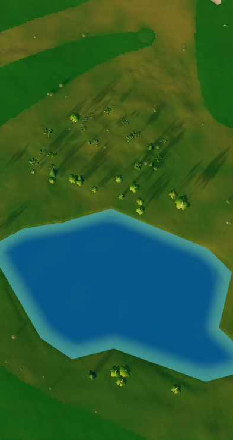

# Johannesberg pond levels and banks

Based on main `5224944e30062696d4a72cb6a57fce65dddc6ed6`, including the
September 13 orthophoto-based ground-surface correction. Applies to the shared
ponds of Johannesberg's eighteen- and nine-hole courses.

## What made the water look too low

The screenshots show broad exposed margins and rectangular dents beside the
ponds. Raising every sheet would conceal some of this while moving the water
away from its measured elevation.

The published Lantmäteriet 1 m terrain reproduces a concrete defect: the
8 m water-bed field's cell-centre interpolation reaches outside the mapped
ponds. In the course window, **17,319 dry 1 m terrain nodes** would be lowered,
with a maximum cut of **0.969 m**. These are source-grid node counts, not a
surveyed erosion area. The generic waterline colour also paints a sandy strip
over low ground where the orthophoto shows turf, reeds and vegetated banks.

Startup compounded the problem. It first carved the fixed-frontier sampler
using the pack's levels, sampled that altered ground to remeasure water,
then carved the world again. Comparing only raw shoreline elevations misses
this first carve. A browser run of main establishes that its nine rendered
pond levels were actually 0.09–0.22 m above their source terrain plates.

## Source evidence

`johannesbergbuild/mapping/water-source-review.json` records three exact public
Lantmäteriet `Ortofoto_0.16` WMS windows, bounds, image sizes and SHA-256 hashes.
Their **capture date is unverified**; it is not borrowed from the separate
2025-06-14 RGBI acquisition. Raw images and diagnostic overlays stay in the
ignored cache and are not published as app textures.

The imagery corroborates the existing bank footprints and their vegetated
margins. The footprints are retained, including the narrow waterways and
crossings; no automatic DTM flood contour, fitted shift or cosmetic smoothing
is adopted. Manual shoreline uncertainty is approximately 2 m, greater where
reeds or shade obscure the edge. Retaining these outlines is not a claim that
each angular segment is a surveyed waterline.

The independent pond-survey CLI verifies the published terrain and its hashes,
then measures each pond's finite interior samples in RH 2000. Five dispersed,
flat interior controls per pond are mapped into the orthophoto with PROJ and
checked against the source terrain. Runtime measures these 45 controls before
any world-bed carving and requires complete coverage, a flat plate and agreement
with the reviewed source. Weak or changed evidence uses the existing generic
measurement. These levels describe the terrain source epoch, not today's water
levels; the DTM does not establish bathymetry.

| Pond identity | Source level, RH 2000 (m) | Main's rendered level, legacy (m) | Revised display level, legacy (m) |
|---|---:|---:|---:|
| w539915580 | 10.27 | 16.03 | 15.9976 |
| w539915583 | 10.91 | 16.70 | 16.6376 |
| w539915581 | 10.24 | 16.06 | 15.9676 |
| w539915582 | 10.91 | 16.71 | 16.6376 |
| w539915584 | 10.87 | 16.64 | 16.5976 |
| w539915585 | 10.85 | 16.74 | 16.5776 |
| w539915586 | 11.27 | 17.06 | 16.9976 |
| w539915578 | 10.41 | 16.22 | 16.1376 |
| trace-pond-18-north | 10.27 | 16.11 | 15.9976 |

Legacy coordinates use the existing 5.6676 m datum bridge. The revised display
adds the shared 0.06 m clearance to avoid coplanar rendering. The decimals
document that transform, not survey precision. Relative to the actual main
runtime this changes levels by -0.03 to -0.16 m; the visible improvement comes
from restoring the banks rather than raising the water.

## Implementation

- Defer Johannesberg's initial fixed-frontier carve so its source sampler
  remains raw. The world creates the illustrative bed after level measurement.
- Match every pond against the complete pinned pack geometry before adding
  source IDs and review metadata. A changed baseline fails before mutation.
- Refine the bed inside the exact mapped polygons and their coarse interpolation
  margins. Outside the footprint, depth is zero. This eliminates every reproduced
  dry-bank cut while retaining wet interiors, narrow connections and causeways.
- Keep the world's existing 2049 × 2049, 8 m arrays. The refinement is bounded
  to the nine ponds and adds no texture allocation or water draw calls.
- Reapply the same refinement after prepared-water restoration. Its flags,
  rings and levels enter the prepared input identity; the review JSON also
  participates in the source revision, invalidating old water and tint bakes.
- Preserve natural ground colour on the reviewed vegetated margins. Existing
  ground-surface corrections, playing geometry and source terrain files remain
  intact. Other courses retain their current water policies.

Both WebGL2 and WebGPU consume the same water levels and carved terrain field.

## Verification

Reproduce source and geometry checks from the repository root:

```sh
node johannesbergbuild/mapping/check-water-source-review.mjs
python johannesbergbuild/mapping/check-water-orthophoto.py --fetch
```

The source check verifies all nine plate levels, all 45 controls and published
source hashes, reproduces 17,319 old dry-bank cuts and asserts zero new cuts.
The orthophoto check verifies all three pinned image hashes and coordinate
conversions. A changed viewing mosaic requires another review.

59 focused tests pass across eight water, terrain, prepared-cache and retained
ground-surface files. They include dry-bank tile carving, a narrow causeway,
a wet neck narrower than the coarse raster, an island, a rotated bridge,
prepared-payload restoration and both actual course packs.

The production build and app/renderer build checks pass. The actual WebGL2
browser run also passes for both course packs: nine source-derived levels,
nine refined beds and all ten retained ground-surface controls per course.
Six app frames were captured with an Android mobile profile and a wider
viewport; neither course reported a browser error. These are software-adapter
renders, not device FPS measurements.

Reproduce with `node tools/check-johannesberg-water.mjs` after building the
app. The harness starts its own preview, and `--gpu` selects WebGPU explicitly
and refuses a silent WebGL fallback. The software WebGPU adapter was available,
but its actual app run timed out waiting for `#boot.done` after 600 seconds.
No WebGPU visual pass or hardware performance result is claimed. The shared
level/bed logic is covered by the source, CPU and WebGL2 checks above.


