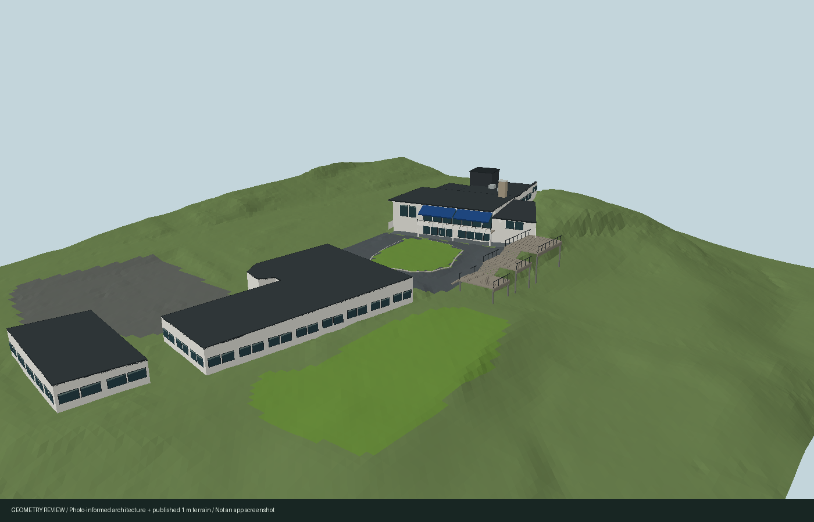
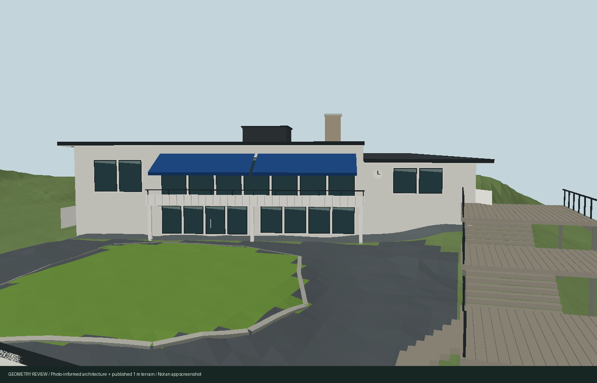

# Lidingö clubhouse architecture and courtyard

The detailed Blender facilities revision of 10 September 2026 supersedes this
procedural display model in the default environment. See the
[authored facilities and validation](../../lidingobuild/facilities/README.md).
The implementation below remains the fallback and structural baseline.

The previous facade pass left the laser roof TIN as the visible roof. It still
looked like a broken tent: first-return triangles bridged vertical roof steps,
the chimney and a rooftop service room, while partial support left open walls.
The default scene now uses a separate architectural display model. The measured
source geometry remains available unchanged, including its uncertainty and gaps.

## Public references

Reviewed 2026-09-09:

- [Lidingö GK's July 2024 Vikingaskeppet report](https://www.lidingogk.se/nyheter/vikingaskeppet-6-7-juli/): stepped roof, separate service room and chimney, paired blue awnings, white facade, asphalt courtyard and tiered timber terrace.
- [Club photo gallery](https://www.lidingogk.se/banan/bildgalleri/): lower white pavilion, ordinary framed windows, veranda and relationship between buildings.
- [Lidingö Golfrestaurang exterior photographs](https://venuu.se/lokaler/lidingo-golfrestaurang): reception glazing, balcony apron, dark rail, white supports and facade clock.
- [Club history](https://www.lidingogk.se/klubben/historia/lidingoe-golfklubb-1933-2013): restaurant and reception/shop changes, putting green, asphalt and enlarged terrace.

No reference photograph pixels or user screenshots are bundled. This revision
adds no private orthophoto crops, credentials, decryption keys or new observations
from private imagery. Existing encrypted orthophoto assets are unchanged.

## Building identities and display model

| Source footprint | Display interpretation | Triangles |
| --- | --- | ---: |
| `way/32262183` | Restaurant/reception: white stepped volumes, smooth dark roof plates, rooftop service room, chimney, paired blue awnings, recessed glazing, panelled balcony, rail, columns, clock and entrance apron | 2,101 |
| `way/32262176` | Lower courtyard pavilion: white walls, shallow roof, framed windows and veranda | 818 |
| `way/32262169` | South annex: white walls, shallow roof and restrained windows | 366 |
| `way/26408210` | Separate building beside the range: two smooth fitted roof planes, neutral walls and small windows | 547 |
| `way/26408211` | Separate building across the range road: two smooth fitted roof planes, neutral walls and small windows | 466 |

The three clustered buildings belong to the clubhouse area. The two long
range-side buildings are separate mapped structures; the references do not
establish their exact current uses. They do not receive restaurant features.

Roof plates cover the retained footprint outlines. Walls close the display
volumes, sampling the published terrain at metre intervals along their bottoms.
The restaurant facade is recessed 2.1 m beneath the source roof outline. Its
balcony deck is at 33.55 m RH2000. Windows, awnings, recesses, roof partitions,
terrace dimensions and unphotographed elevations are visual estimates. Filling
an unsupported source region for display does not turn it into a measurement.

The local roof planes are constrained by robust fits to the retained 2021 laser
vertices, then simplified into architectural forms. In each facade frame,
`y = a*u + b*v + c`, with `y` in RH2000 metres. The frames are defined in
`lidingo-architecture.js`; these coefficients are not global map coordinates.

| Roof section | a | b | c |
| --- | ---: | ---: | ---: |
| Restaurant main | -0.001 | -0.029 | 37.692 |
| Restaurant lower west | -0.040 | -0.009 | 34.525 |
| Restaurant east | -0.002 | 0.036 | 36.570 |
| Pavilion display approximation | -0.006 | 0.045 | 32.300 |
| Annex display approximation | 0.002 | -0.024 | 31.920 |
| West range building, plane 1 | 0.888 | -0.003 | 32.354 |
| West range building, plane 2 | -0.891 | 0.005 | 38.616 |
| East range building, plane 1 | 0.966 | 0.013 | 29.320 |
| East range building, plane 2 | -0.983 | -0.017 | 37.330 |

The range roofs retain their asymmetric measured ridges. The restaurant's high
returns become separate service-room and chimney volumes, informed by the
public exterior photo, instead of triangles stretched across those steps.

## Courtyard and terrain

The mapped courtyard hardstanding receives an asphalt appearance override,
with its original `sourceMaterial` retained alongside the evidence label.
Every facility ring, including the courtyard's green island, stays unchanged.
The putting-green kerb follows the mapped edge; it does not round or move it.
A small terrain-following entrance apron fills the area under the facade recess.

Three estimated timber terrace levels run along the courtyard's east edge, with
connecting stairs, rails, supports and a courtyard access opening. These are
appearance geometry, not newly surveyed facility or vegetation-exclusion data.
The terrace and kerb add 1,936 triangles. No parked vehicles, tables or occupants
are inferred from a particular photograph.

## Source preservation and runtime inspection

All five roof sources, their 7,069 triangles, footprints, unsupported regions,
height values and data checksums remain unchanged in the model and shipping pack.
The [building evidence](../../lidingobuild/mapping/buildings.md) still describes
those dated measurements and their limitations. The normal display uses 4,298
building triangles plus 1,936 courtyard triangles, all in the existing static
building batch. There are no additional draw calls, image textures, remote
requests or per-frame architecture updates. Other courses keep their own models.

Append `&buildingGeometry=source` to a Lidingö URL to inspect the original TIN and
its supported walls. This disables the authored buildings and terrace/kerb; the
asphalt appearance override still applies. `V3D.stats` distinguishes:

- `sourceRoofBuildings` / `sourceRoofTriangles`: retained source counts, 5 / 7,069.
- `architecturalBuildings` / `architecturalTriangles`: default display, 5 / 4,298.
- `measuredRoofBuildings` / `measuredRoofTriangles`: actual raw TIN rendering; zero by default, 5 / 7,069 in source mode.
- `clubhouseDetails` and `courtyardDetails`: emitted part names and triangle counts.

## Review and validation

These are CPU geometry review images, not app screenshots. They render the exact
emitted building triangles against checksummed public **1 m terrain chunks** from
the shipping ground graph, with neutral ground and simple lighting. They do not
show the app's vegetation, shadows, material shader, atmosphere or antialiasing.





Reproduce from the repository root (Python requires NumPy and Pillow):

```sh
node lidingobuild/render-architecture.mjs
python lidingobuild/render-architecture.py
pnpm exec vitest run apps/golf/src/engine/scenery/lidingo.test.mjs apps/golf/src/engine/measured-roof.test.mjs
```

The fixture verifies public terrain chunk checksums, decodes the shipping pack
and rejects samples outside 1 m coverage. Tests cover source immutability, exact
roof footprint coverage and upward winding, finite/nondegenerate triangles,
unchanged facility geometry, the five-building scope and a combined 6,500-triangle
budget. Production build and source/mapping audits are also checked for this
revision; the pull request records the final suite result.

The supported browser in this environment cannot create a 3D graphics context.
In-app WebGL/WebGPU, shadows and phone appearance remain unverified for this
revision. The updated runtime/facility review scripts retain all source-data
equality checks and distinguish the authored display from measured sources;
they need a graphics-capable environment to execute. Inspect the courtyard and
an elevated southeast view in daylight on a device before treating this as a
verified visual replica. It is a photo-informed approximation, not a survey of
every elevation or a claim that current mapping is complete.
