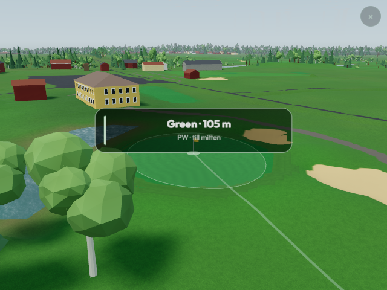

# Tortuna runtime review — 2026-09-09

This records the initial implementation. See the subsequent
[refinement review](tortuna-refinement-review.md) for the expanded environment,
measured roofs, revised surfaces and current validation evidence.

Tortuna is implemented as a provisional 18-hole, par-71 course on
`codex/tortuna-golf-course-v2`. The branch contains the latest verified main
commit `3ddb506`. This build starts from the retained source intake; the missing
historical implementation cited in the earlier handoff was not recovered.

The current club/Caddee card provides Gul, Blå, Röd and Orange tee distances.
GolfTraxx supplies routing references; the club's current short par-3 ninth
replaces its older par-4 tee reference. The course uses 2026 Lantmäteriet
orthophoto observations, native 1 m terrain and laser-derived canopy from 2021.
See [source research](tortuna-source-research.md),
[source ledger](../../geo_data/course-v2/tortuna/source-manifest.json) and
[rebuild instructions](../../tortunabuild/README.md).

## Retained source and runtime contracts

The native 4097 × 4097 terrain retains the complete measured 4096 m square,
341 terrain tiles and 340 explicit parent links. Sixty stand fields represent
measured canopy density; individual tree locations and species remain visual
representations, not a surveyed stem inventory. The published graph contains
403 chunks, including its terrain shell, stands and routing.

The frame is E597400.5/N6614899.5/H16.31, EPSG:3006 with RH 2000 heights.
Its fingerprint is
`37b54e5fe18ad889e656639aa7fb4c5166899875029c72d6d624694b319c287f`.
The course model SHA-256 is
`12d9fda78e8ece174c278c7aef581d18dedb802c39f3e2506816efd6c1e96f8e`.

There are 82 playing-surface polygons: 18 greens, 18 observed tee platforms,
32 bunkers and 14 partial fairway/approach candidates. The 28 facility polygons
include practice turf, range mats/targets, a shelter, parking and paths. The
source water union is preserved. The clubhouse's yellow walls and brown roof
follow the club photographs; its height and architectural detail are display
estimates. Raw photographs and national orthophotos stay in the ignored cache.

## Validation

`npm test` passes: 572 Vitest tests in 85 files and 418 Node tests, with three
optional skips and no failures. Source-manifest, course-pack, production-build,
app-isolation and renderer-build checks pass. The source planner includes ten
grounds, thirteen course slugs, 198 holes and 279 distinct windows; Tortuna
contributes eighteen holes and 29 windows.

The [native terrain validation](../../tortunabuild/mapping/native-terrain-validation.json)
samples 36 tee/green references through the real runtime loader. The maximum
difference from the native DTM is 0.004034275230864637 m, inside the 0.005 m
encoding tolerance. This verifies encoding consistency, not independent
geographic or height accuracy.

Source guards reject altered native rasters, moved frames, reduced coverage,
changed routing geometry and stale vegetation inputs. Git attributes preserve
checksummed source bytes across Windows and Linux checkouts. Final asset review
verified all graph references, parent relationships and checksums; existing
course registry entries remain unchanged.

## Browser evidence

The production build was captured with `tools/v2-graphics-review.mjs`,
`v2=require`, quality locked low, graphics enabled and software SwiftShader.
The tool checks settled residency, visible terrain, data/camera/quality
stability and no failed/loading tiles. These are rendering correctness checks;
they provide no native-device performance evidence.

| Mode | Viewport | Views | Result |
| --- | --- | --- | --- |
| Explicit WebGL2 | 640 × 480 | Hole 1 tee; holes 9 and 18 green | [Pass](../../tortunabuild/mapping/browser/webgl2/report.json) |
| Automatic WebGL2 fallback | 390 × 660 | Hole 9 top | [Pass](../../tortunabuild/mapping/browser/mobile-fallback/report.json) |
| Explicit WebGPU request | 390 × 660 | No completed capture | [Unavailable adapter](../../tortunabuild/mapping/browser/webgpu-phone/report.json) |

This Windows software environment reports no available WebGPU adapter. The app
falls back to WebGL2, causing the strict WebGPU backend check to fail. That
failed report is retained. The separate automatic-fallback run passes with
reversed depth enabled. Portrait dimensions test layout, not a physical phone.
Both successful runs have zero recorded errors and matching model fingerprints.
Service-worker blocking and superseded terrain-request warnings are retained.

The assistant inspected all four successful captures: continuous terrain and
mapped green/bunker/water surfaces are visible, and the current short ninth
and yellow clubhouse are recognizable. This limited camera set is not named
human acceptance or a complete hole-by-hole source survey.



Other captures: [first tee](../../tortunabuild/mapping/browser/webgl2/h1_tee_noon.png),
[eighteenth green](../../tortunabuild/mapping/browser/webgl2/h18_green_noon.png),
[portrait ninth](../../tortunabuild/mapping/browser/mobile-fallback/h9_top_noon.png).
Exact build HTML, source and report hashes are in
[build evidence](../../tortunabuild/mapping/build-evidence.json).

To repeat after building the app, provide Chromium through `CHROME_BIN` or
append `--chrome` with its executable path:

```powershell
node tools/v2-graphics-review.mjs --root apps/golf/dist --out tortunabuild/cache/recheck-webgl2 --course tortuna --backend webgl2 --q lo --graphics 1 --views 1:tee:noon,9:green:noon,18:green:noon --width 640 --height 480 --timeout 300
node tools/v2-graphics-review.mjs --root apps/golf/dist --out tortunabuild/cache/recheck-fallback --course tortuna --backend webgl2 --auto-fallback --q lo --graphics 1 --views 9:top:noon --width 390 --height 660 --timeout 300
```

## Remaining source work

Independent horizontal and vertical controls remain unapproved. Tee platforms
for holes 4, 6, 12 and 15 are unresolved; all coloured marker positions and
daily flag locations are unverified. Source camera references and virtual green
targets remain explicit. Fairway edges are incomplete, especially hole 6 and
several front-nine segments. Shadows obscure parts of greens 3, 4, 5, 8, 11
and 16. Further evidence is needed for complete facilities, paths, ditches,
local-rule boundaries and current vegetation. There is no bathymetry or verified
individual stem inventory. Production and independent survey gates stay open.
