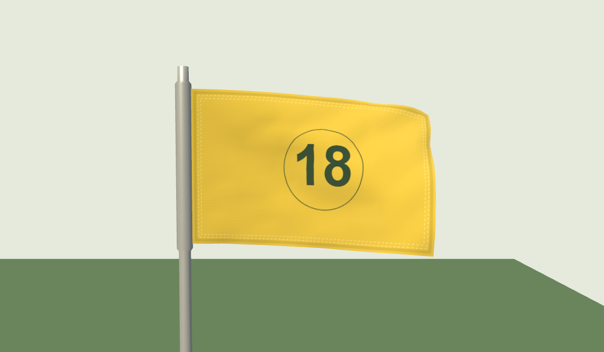
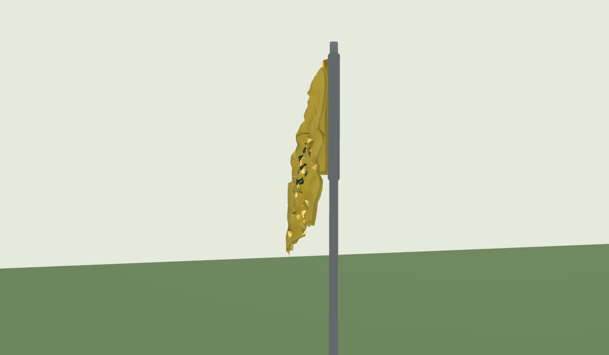
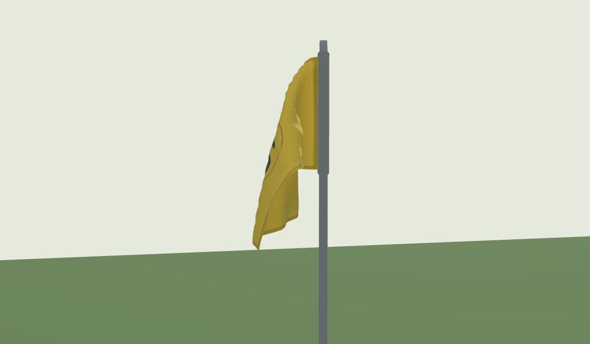
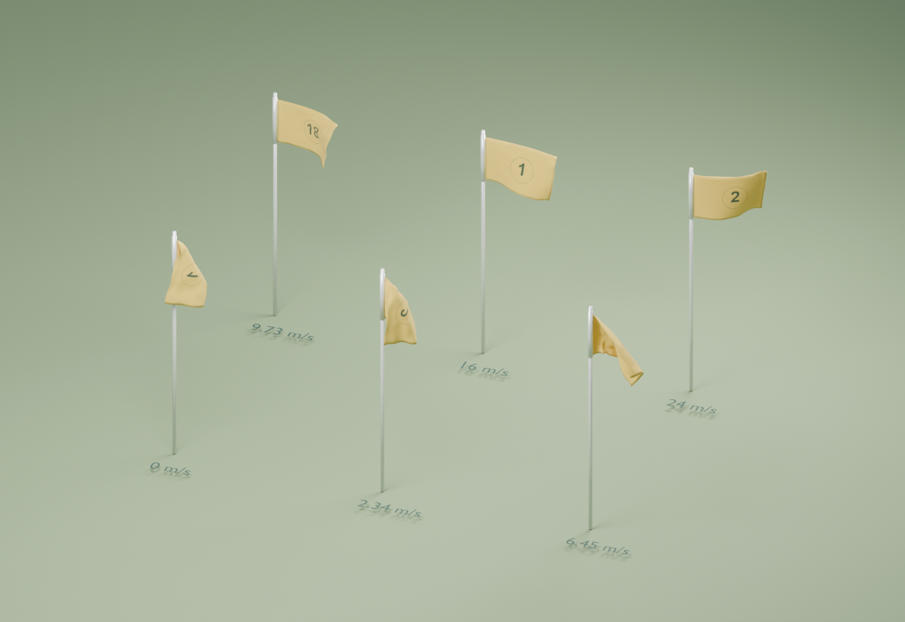

# Flag cloth refinement — 2026-09-21

New cloth simulations were authored through the live Blender MCP bridge in
Blender 4.5.9 LTS and integrated into the shared course renderer. This supersedes
the asset and material described in [the previous review](flag-design-wind.md).
The original Blender workspace was copied to
`tools/blender-flag/cache/before-flag-refinement.blend` before authoring.
The second pass also saved `before-flag-dynamics.blend` and restored the live
tree study after authoring; the flag review is a separate project.

| Property | Previous asset | Current asset |
| --- | --- | --- |
| Grid | 17 × 11 / 187 vertices | 25 × 17 / 425 vertices |
| Wind states | 8, up to approximately 10 m/s | 6, calm through 24 m/s |
| Loop | 4 seconds at 15 fps | 6 seconds at 30 fps |
| Download | 200 KB | 1.10 MB, shared by all courses |



## Shape and motion

The reported rear-view glitch was reproduced in light wind, including at
2 m/s. The earlier calm-only edit did not address the adjacent moving poses.
Those three low-wind bakes are now replaced by one coherent broad-fold Blender
animation at a measured 2.34 m/s, with turbulence reduced to 6, larger eddies,
wind noise 0.1, body bending 0.03 and more air damping. The calm drape remains
static.

The latest pass also replaces the old moderate/fresh/strong states with one
broad-fold Blender bake at 6.45 m/s: turbulence 60, bending 0.02, air damping
0.5, larger eddies and noise 0.15. Its lateral coordinates are mirrored so that
its folds face the same way as the light-wind drape. Opposite folds previously
cancelled during blending and created very small triangles that flipped abruptly.
This source change removes two redundant states, reduces the download from
1.31 MB to 1.10 MB, and keeps the runtime constraint count unchanged. Calm,
light wind and the three fully extended wind states retain their source geometry.
Export precision is now 0.1 mm instead of 0.2 mm: the coarser rounding could
move a triangle to the other side of a crease and trigger a sharp normal change
even when the source animation passed. The regression reads the shipped binary.

Runtime bend constraints resist sharp turns between nearby vertices, fading
continuously out by 7 m/s. Constraint rebound also fades toward zero in calm.
This prevents the area/length solver from rebuilding narrow accordion folds
while preserving the pinned sleeve, cloth area and inertial response.

[Interactive before/after comparison](graphics/flags-folds-2026-09-21/index.html)
opens on the reproduced 2 m/s rear view, with five wind speeds and three angles.




Blender uses a flat rest shape, pinned hoist, self-collision and pole collider.
Mass and air damping scale with grid density. Moving turbulence and gently
varying wind prevent light cloth from freezing into a single fold. The 16 and
24 m/s states keep the flag extended while increasing flutter. One redundant
state only 0.13 m/s from its neighbour was omitted to avoid rapid morphing
between different folds in almost identical wind.

The stronger-wind Blender bakes use reinforced hems at bending stiffness
0.012, versus 0.003 for the body; moderate wind uses 0.04 hems and a 0.02 body;
calm and light wind use 0.06 hems and 0.03 bodies. The runtime preserves the sheet's actual dimensions
with interleaved edge, triangle-area and sleeve-contact constraints. Initial
poses receive 24 passes; continuing frames use eight, starting from the previous
pose. A final tension limiter prevents long, narrow triangles from hiding behind
an acceptable total surface area.

A sweep of 0-28 m/s in 0.25 m/s increments, at 30 fractional times around the
loop, retains **99.6-101.9%** of nominal fabric area. Worst measured structural
edge stretch is **16.4%**, and free vertices stay at least 41 mm from the pole
axis in this sweep. The preceding pass retained 96.1-102.3% of area. The
[asset audit](graphics/flags-motion-2026-09-21/cloth-audit.json) records raw baked
metrics separately from the constrained runtime sweep and fails if these limits
regress.

Periodic monotone cubic interpolation removes velocity corners at baked frames
without overshooting their sampled coordinates. Wind response filters the airflow
vector, so opposing air unloads the fabric before it fills in the other direction.
Each vertex also retains position and velocity across frames. When the sleeve
turns, those values are rebased into its new frame; the fly keeps its momentum
instead of rotating rigidly with the pole. Springs now account for the guide's
motion between samples, while damping the cloth's own velocity. The previous
spring treated each new guide as stationary throughout the whole interval,
changing fast flutter at lower frame rates. At 24 m/s, maximum coordinate RMS
against a 144 Hz reference across a six-second trajectory fell from 4.99 to
1.91 cm at 30 Hz and from 1.93 to 0.55 cm at 60 Hz. The 15 Hz distant-flag mode
still resolves fast flutter less accurately. Fabric constraints let the shape
catch up. In still air, the animation clock stops and
the cloth settles. Resuming after a long hidden interval resets safely.

The [current motion review](graphics/flags-motion-2026-09-21/index.html)
shows a close view through light, moderate and strong wind, storm, reversal,
and settling to calm. It contains 720 production frames at 30 fps with playback
and scrubbing. The earlier [calm orbit review](graphics/flags-folds-2026-09-21/webgl2-motion.html)
records the preceding version at 10 fps.

Nearby flags update every frame. Smaller flags update at 30 Hz beyond 60 m and
15 Hz beyond 150 m (100 m in low quality). Previous 220/380 m freeze limits
remain. Wind state and orientation keep advancing independently. Scratch
buffers, textures and materials are reused. The procedural fallback shares
the material, attachment, wind response and increasing flutter rate.

These are art-calibrated animations with a guided inertia solver, not a validated
aerodynamic model. A conservative contact plane on the downstream side of the
sleeve prevents pole penetration; it does not simulate fabric wrapping around
the pole. Self-intersection of every interpolated triangle is not guaranteed.
Above 24 m/s, shape is bounded to the strongest bake and its playback rate
increases modestly. The area audit
does not prove visual perfection or real-world physical accuracy.

## Material and Blender project

Yellow nylon now has a higher-resolution number atlas, double stitching,
reinforced hems, mipmapped warp/weft normals, roughness variation and restrained
cloth sheen. Flags now receive the course shadows. Backlighting follows folds,
sun direction and atmosphere, with reduced transmission at doubled hems and
dark ink. Hole numbers remain generic.



The [Blender project](graphics/flags-motion-2026-09-21/flag-wind-study.blend) contains six
animated comparisons with packed artwork. Play frames 1–180 at 30 fps. Its poses
come from the exported simulations; the browser adds wind blending and direction
response. The [reopen audit](graphics/flags-motion-2026-09-21/blender-reopen-audit.json)
compares saved geometry with the source at frames 1, 90 and 180.

## Validation and reproduction

78 tests passed across flag cloth, wind motion, weather, camera order, material
graphics and camera handoff. Coverage includes asset integrity, seams,
interpolation bounds/velocity, opposing-fold area loss, pole clearance, north
crossings, reversals, calm, storm response and fallback normals. New coverage
exercises a sequence of gusts,
reversals and lulls; bounded area/stretch; retained world-space inertia; settling
in calm; an identical calm drape at every animation phase; deterministic reset;
and comparable trajectories throughout a full loop at 15/30/60/144 Hz. A regression checks curvature in
both fabric directions and per-frame displacement across three seeds during
15-second sequences of changing 0-3 m/s wind. It bounds sharp local folds and
movement jumps in the actual displayed mesh. The production
build passed. An isolated build was written to
`tools/blender-flag/cache/app-motion-build` to keep validation independent of
other work in the shared workspace.

The new face-level regression checks each displayed triangle at 4, 5, 6 and
8 m/s across two starting phases for nine seconds at 60 Hz. A broader
[four-phase audit](graphics/flags-motion-2026-09-21/runtime-face-audit.json)
of the shipped binary found no face-normal steps above 90 degrees: the maximum
was 78.14 degrees and the smallest individual triangle retained 59.09% of its
nominal area. This catches localized collapse hidden by aggregate fabric area.
It is bounded coverage, not a guarantee for every possible wind history.

Chrome rendered both WebGL2 and WebGPU successfully with 23 captures per
backend and no console/page errors. The harness covers calm/light/strong wind,
fallback, detail, backlighting, dusk, gusts, reversal and return to calm. Reports:
[WebGL2](graphics/flags-motion-2026-09-21/webgl2-result.json),
[WebGPU](graphics/flags-motion-2026-09-21/webgpu-result.json).
These checks do not establish mobile frame rate.

```sh
node tools/blender-flag/blender-bridge.mjs tools/blender-flag/inspect_scene.py
node tools/blender-flag/blender-bridge.mjs tools/blender-flag/bake_flag_cloth.py --timeout=1200
node tools/build-flag-cloth.mjs
node tools/blender-flag/audit-cloth.mjs
node tools/check-flags.mjs --fold-review --wind-motion --out=tools/goldens/flags-motion
node tools/check-flags.mjs --webgpu --fold-review --out=tools/goldens/flags-motion
node tools/blender-flag/blender-bridge.mjs tools/blender-flag/build_review.py
node tools/blender-flag/blender-bridge.mjs tools/blender-flag/audit_motion.py
blender --background docs/graphics/flags-motion-2026-09-21/flag-wind-study.blend --python tools/blender-flag/verify_review.py
```

Set `BANVY_CHROME` to an installed Chrome executable if Playwright's browser is
unavailable; `BANVY_GPU=1` enables the Windows hardware rendering path.
The harness uses production modules through a virtual Vite entry, without
adding a study page to the shipped application.

App controls remain `?vind=270,5,9` (wind from west, 5 m/s, gust 9 m/s),
`&flagcloth=0` (fallback), `&det=1` (fixed pose), and `V3D.flags()` (diagnostics).
