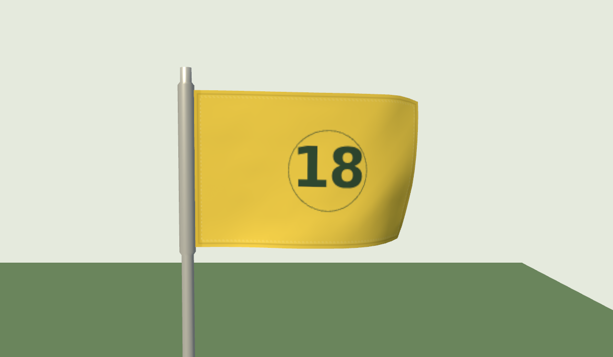
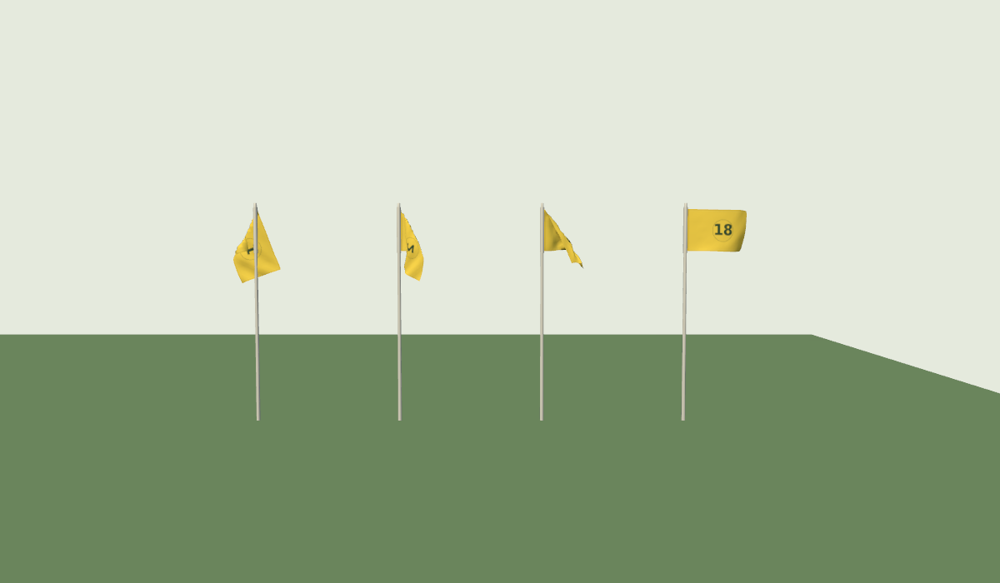

# Flag design and wind response — 2026-09-20

The pin flags now blend continuously between the existing cloth animations as
wind speed changes. A new weather reading or interrupted gust updates the
target without discarding the current response. Direction follows the shortest
arc, including readings crossing north. Gusts rise and settle through a smooth
envelope; each flag retains its own timing. The procedural fallback uses the
same response, material and attachment, with two travelling ripples and normals
updated as the fabric moves.

The existing eight-band Blender asset and bake scripts are unchanged. No new
cloth simulation or Blender installation is required.

## Appearance

- One shared material and number atlas for the course: yellow fabric, turned
  hems, stitching, a reinforced hoist and a simple hole-number roundel. These
  numbers are a generic design, not representations of official club badges.
- Subtle mipmapped weave and roughness variation. Backlighting follows the
  cloth normals, sun direction and atmosphere; printed ink remains dark.
- Pole diameter now matches the intended 4.5–3.5 cm taper. The previous radii
  made it twice as thick. The sleeve remains part of the same instanced mesh.
- Each posed cloth is translated by its actual pinned edge. This matters
  because the bake's per-band azimuth correction put that edge at different
  x/z positions. A fixed translation would detach some bands from the new
  2.6 cm-radius sleeve. No cloth vertices or dimensions are rescaled.





The baked mesh remains 187 vertices. Distant pose updates still stop at 220 m
in low quality and 380 m otherwise; the small wind/clock state keeps advancing.
The canvas atlas is generated once, and wind changes do not rebuild materials,
textures or geometry. Baked frames are accumulated directly into the geometry
buffer instead of copying through a second pose buffer.

## Review and verification

The existing URL controls remain available:

- `?vind=270,5,9`: wind from west, 5 m/s mean, 9 m/s gust peak.
- `&flagcloth=0`: exercise the procedural fallback.
- `&det=1`: fixed clock, exact requested speed/direction, no gusts or drift.
- `V3D.flags()`: target wind, responding speeds, neighboring bands and blend
  weights, measured cloth hang, and rendered orientation.

Focused tests cover the existing asset's integrity, interpolation continuity,
attachment at all sampled speeds/frames, north-crossing direction changes,
interrupted readings, frame-rate independence, deterministic capture, gust
envelopes, fallback bounds/normals, texture coordinates, weather and camera
integration. Production build and the application's no-undef lint also pass.

Result: **64 tests passed** across the six suites below. The WebGL2 visual
harness passed with five captures and no console/page errors.

```sh
pnpm exec vitest run apps/golf/src/engine/flag-cloth.test.mjs apps/golf/src/engine/flag-motion.test.mjs apps/golf/src/engine/weather.test.mjs apps/golf/src/engine/camera-frame-order.test.mjs apps/golf/src/engine/material-graphics-polish.test.mjs apps/golf/src/engine/camera-handoff.test.mjs
pnpm --dir apps/golf build
node tools/lint-app.mjs
node tools/check-flags.mjs
BANVY_CHROME=/path/to/current/chrome node tools/check-flags.mjs --webgpu
```

The visual harness loads the production modules in a virtual Vite entry; no
study page is added to the shipped app. It captures baked/fallback comparisons,
detail, backlighting and dusk, then advances live wind and checks the attachment
and finite geometry. Captures go to the ignored `tools/goldens/flags/` folder.
Three.js r186's WebGPU texture-view descriptor requires a current browser;
Chromium 140 rejects its `swizzle` field before the material can be reviewed.
Chromium 151's headless shell got past that API mismatch but lost its WebGPU
device (`A valid external Instance reference no longer exists`). A second run
using a plain untextured standard material failed the same way. WebGPU visual
verification remains open; its blank captures are not evidence of a pass.

The full Ängsö app was also booted in WebGL2, low quality, at 5 m/s with
`v2=0&det=1`: 18 baked flags, expected neighboring-band weights, correct
downwind direction, and no page errors. This sparse checkout used the app's
procedural tree fallback. Terrain and course data were not modified.

Software-rendered captures verify appearance and execution, not hardware FPS.
