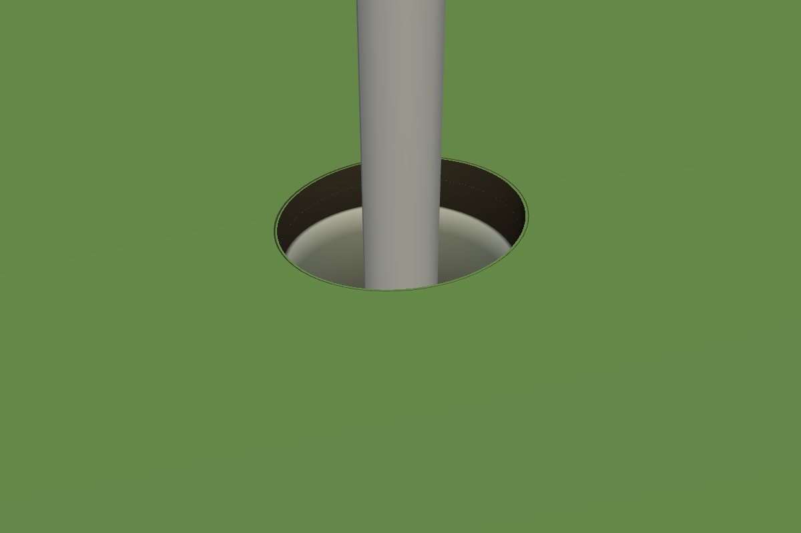
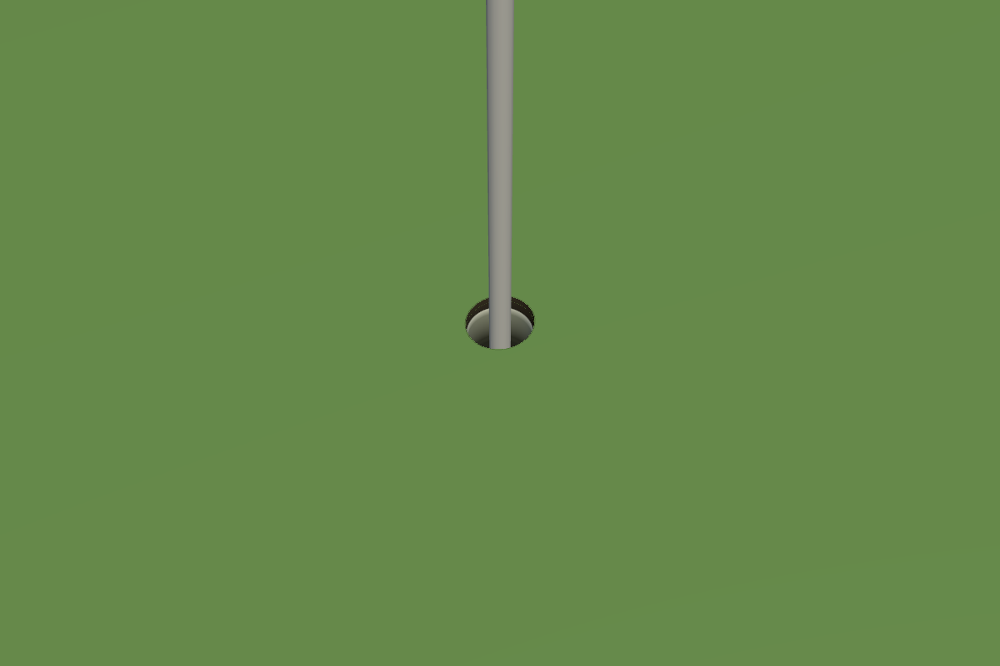

# Recessed golf cups

The old cup was a closed 108 mm dark cylinder whose top stood 8 cm above the
terrain. The terrain remained solid underneath it. A tactical target disc and
the green's screen marker also covered the flag base, while orbit zoom stopped
six metres away.

This change adds a circular opening through the drawn ground, a thin cut turf
edge, soil above a recessed pale liner, cavity shading and a closed dark bottom.
The flagstick extends into the cup. The opening is now 140 mm across, a deliberate
display enlargement that preserves the existing, distance-readable pole. The
size is fixed in world space. The liner begins 27 mm below the lowest rim
sample and the interior is 130 mm deep. These are generic rendering dimensions,
not surveyed equipment for a particular course.

## Readability and reference direction

The pole remains 45 mm across at its base, as requested. Enlarging the opening
from 108 to 140 mm gives approximately 48 mm of clearance on each side instead
of 32 mm. It does not alter cloth attachment, pole geometry or wind animation.
This is a visual proportion choice for Banvy, not a regulation dimension or
a change to ball physics.

For a premium result, judge the whole presentation: a clean turf cut and pale
recessed liner at putting distance; a legible pole, fabric silhouette and hole
number farther away; stable lighting and smooth changes in wind. Increasing the
hole alone cannot establish parity with commercial golf games.

Public reference material checked on 2026-09-20:

- [EA's gameplay deep dive](https://www.ea.com/games/ea-sports-pga-tour/pga-tour/news/ea-sports-pga-tour-gameplay-deep-dive)
  documents Frostbite rendering, adjustable zoom and putting aids.
- [Trackman's Virtual Golf 3 overview](https://support.trackmangolf.com/hc/en-us/articles/29476947436059-VG-Virtual-Golf-3)
  documents green grids, aimed putting guides, heatmaps and contour lines.

Those sources do not specify cup dimensions, flagstick dimensions or cloth
rendering internals. The larger cup is our design decision, not a claim about
either product's implementation. The existing procedural geometry, materials
and wind controls support this work without Blender.

## Rendering

The same mask decorates legacy atlas ground, legacy overlay materials and v2
terrain. It preserves existing coastal masks and geographic surface authority.
A nearest-filtered float texture stores cup centres, and the fragment shader
tests an exact circle; the terrain does not need a finer mesh. The Ängsö mask is
99,264 bytes. All cup interiors are merged into one draw call.

Rim heights follow the rendered terrain. For legacy mesh greens, the rim samples
the actual raised overlay triangles, including creases. Course data, CPU terrain
heights and collision/picking semantics are unchanged: this is a visual cavity.

Zoom now reaches 1.8 m from its target, with the existing ground clearance intact.
Tactical guides fade between 12 and 4 m; the green badge fades between 9 and 3 m.
The green-reading grid also respects the cup opening.

## Verification

The 140 mm refinement passed 14 cup/motion tests and the production build.
The four WebGL2 cup views and exact-opening pixel readback also pass. The
capture harness now uses the actual production pole profile, so visual reviews
retain the app's thickness and taper. Full Ängsö app checks pass in both legacy
atlas and mesh modes: 18 cups, close zoom, hidden close-range pin badge and no
page errors. WebGPU remains unverified for the environment reasons below.

Original recessed-cup verification:

- 50 focused tests: cups, coastal masks, ground materials, rendered height
  sampling, camera handoff and camera frame ordering.
- App lint, module syntax checks and production build pass. The existing large
  chunk warning remains.
- `node tools/check-golf-cups.mjs --app`: WebGL2 render captures from overhead,
  standing height, grazing and close-up views. A pixel readback proves that a
  magenta witness below **both** ground layers shows through the opening while
  neighbouring turf stays intact. The fixture uses the production v2 decorator.
- Complete Ängsö app checks run with `v2=0`, for both `ground=atlas` and
  `ground=mesh`: 18 cups, close camera placement and hidden close-range pin badge.
  Sparse local course assets use the existing procedural tree fallback.
- WebGPU remains unverified in this environment (the prior plain-material
  baseline also lost its software WebGPU device). A full streamed v2 course
  was not rendered in this check.

Reproduce with `node tools/check-golf-cups.mjs --app`. The isolated harness also
accepts `--webgpu` and `BANVY_CHROME` for a compatible browser/device.
