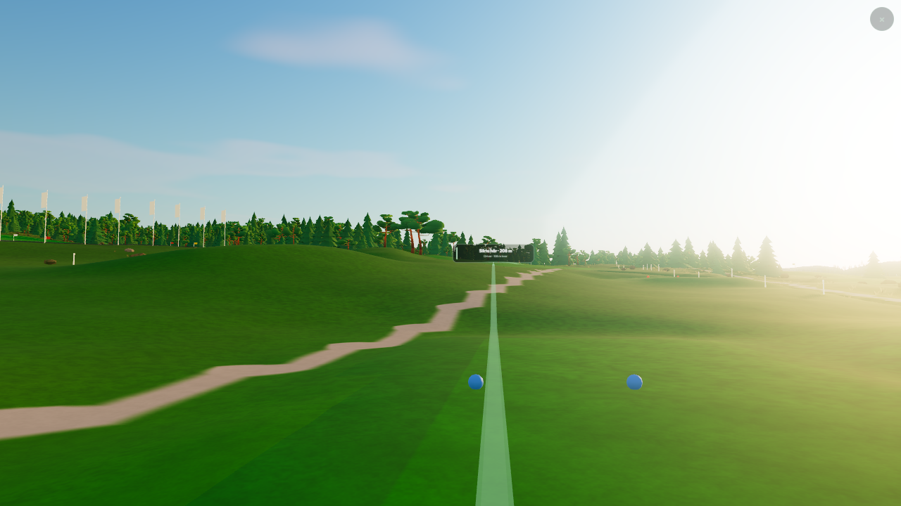
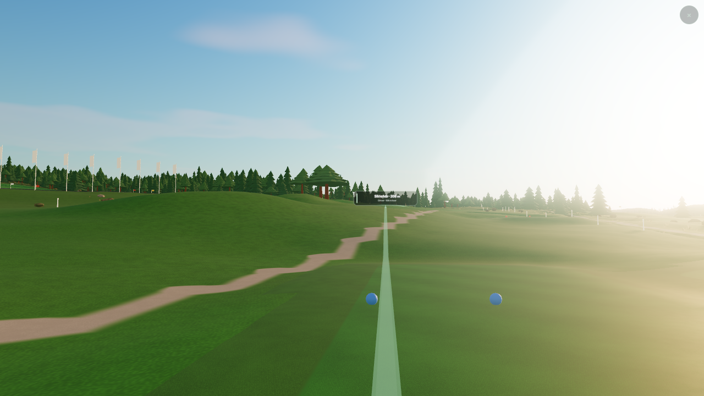

# Shared atmospheric sky

**Follow-up:** [Eight atmospheres](eight-atmospheres.md) now refines every
lighting mode and corrects pale, opaque distance fog. The uniform 0.35 sky
factor and measurements below describe the first shared-sky implementation.

Målad and realistic now use the same r186 atmospheric sky and clouds. The
painted style still controls the course's materials, trees and colour grade.
Sky radiance is reduced before bloom and tone mapping, bringing back blue
and cloud detail without changing the course's exposure or lighting presets.

## Implementation

- `engine/atmospheric-sky.mjs` creates the same `SkyMesh` for both styles and
  both backends. This app uses `WebGPURenderer` even when it falls back to
  WebGL2, so its TSL sky works on that backend too.
- The separate painted dome, cumulus layer and sky palettes are removed.
- The shared sky's HDR radiance is multiplied by **0.35**. Alpha stays opaque;
  the sun disc remains disabled to avoid glare sparkling through foliage.
- The painted post-process grade uses the scene depth to exclude background
  pixels. Its arithmetic blend works with ordinary and reversed depth.
- The existing reversed-depth far-plane correction remains. The sky follows
  the camera, does not write depth and is not fogged.
- Clouds animate normally. `det=1` freezes their drift for repeatable captures.
- The Målad button's descriptions now refer to trees and ground.

Three documentation: [SkyMesh](https://threejs.org/docs/pages/SkyMesh.html),
[WebGPURenderer and its WebGL2 fallback](https://threejs.org/docs/pages/WebGPURenderer.html).

## Visual acceptance

`tools/check-shared-sky.mjs` boots both modes, changes lighting presets, captures
the course, then aims an identical camera above all geometry. It compares sky
pixels across modes and rejects missing shading, inactive renderer/depth/style,
browser errors and inconsistent tree slots. `--before` additionally measures
the previous realistic sky's highlights.

Veckefjärden is the reference course from the owner's screenshot. The fixed
tee capture is at player height; the screenshot supplied by the owner used a
higher camera. The sky comparison uses the same unobstructed direction on both
sides, independent of the differing tree shapes and terrain palette.

Measured in Chrome 152 on the NVIDIA RTX 3070 Laptop, 2026-09-13:

- WebGPU, reversed depth: **all eight presets have identical sky pixels**
  between Målad and realistic (mean difference 0, no pixels over 2/255).
- Hardware WebGL2, high quality: evening and daylight skies also match exactly.
- WebGPU with ordinary depth, and mobile WebGL2 at low quality: evening and
  daylight skies match exactly as well. Mobile omits the post-process pass.
- Puttom in Målad: automatic LOD, all four forced tree tiers, visible terrain,
  overhead camera movement and the shared sky pass all **18 rendering checks**.
- Evening sky mean intensity: **234.6 → 185.8/255**; near-white pixels
  (mean RGB at least 248) **25.0% → 7.2%**.
- Daylight sky mean intensity: **246.5 → 217.9/255**; near-white pixels
  **40.8% → 0.0%**.
- Camera ordering, look selection, environment lighting and water lighting:
  **41 tests passed**. Production build and application lint pass.

The old baseline still animated its clouds under `det=1`. Before/after
brightness numbers describe the captured views, with slightly different cloud
phases. Cross-style comparisons use the new frozen cloud phase on both sides.

[Machine-readable evidence](graphics/shared-sky-2026-09-13/summary.json),
[previous realistic evening](graphics/shared-sky-2026-09-13/before-real-evening.png),
[daylight sky](graphics/shared-sky-2026-09-13/shared-daylight-sky.png),
[storm clouds](graphics/shared-sky-2026-09-13/shared-storm-clouds.png).

| Målad | Realistic |
|---|---|
|  |  |

The baseline is the unmodified r186 application at `5ecc199c`. The new build
includes the current shared checkout; road and shot-planner changes developed
alongside this work are separate. This record's claims concern the sky change.

```powershell
node tools/serve.mjs apps/golf/dist 8620
# In another terminal, on hardware:
$env:BANVY_GPU = '1'
node tools/check-shared-sky.mjs --base http://127.0.0.1:8620
node tools/check-shared-sky.mjs --base http://127.0.0.1:8620 --rdepth 0 --presets golden,noon
node tools/check-shared-sky.mjs --base http://127.0.0.1:8620 --backend webgl2 --presets golden,noon
node tools/check-shared-sky.mjs --base http://127.0.0.1:8620 --backend webgl2 --quality lo --mobile --presets golden,noon
node tools/check-three-rendering.mjs --base http://127.0.0.1:8620 --backend webgpu --tiers
```

Mobile here means viewport/touch emulation in desktop Chromium, not a physical
phone. Output directories contain PNGs and a JSON report, and failed gates
produce a nonzero exit code. The original r185 painted-image parity is now
historical: changing the painted sky is an intentional design change requested
by the owner.
