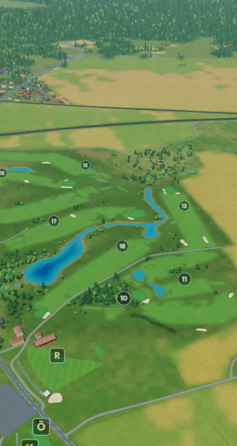

# Tortuna water at distant zoom — 2026-09-21

Tortuna uses measured-only terrain. Its water sheets sit 6 cm above their
source levels, without polygon offset. The WebGL2 camera originally used a
1 m near plane everywhere on this inland course: the existing precision
adjustment was gated on `isSea`, so none of Tortuna's ponds qualified.
At kilometre range, fixed 24-bit depth can quantize the sheet and the terrain
underneath it to the same value. Water disappears into the terrain and changes
visibility with camera movement.

The same bounded, altitude-dependent near-plane adjustment now applies to
measured inland water polygons. It activates only with an active graph terrain
and known world bounds, preserves the scenery allowance and focus-distance
cap, and returns to 1 m near ground level. WebGPU's existing reversed floating
depth path is unchanged. No source levels, terrain heights, shorelines, water
materials, geometry budgets or draw passes change.

## Verification

- The regression uses Tortuna's published pack and executes the application's
  actual eligibility expression. Both tests fail before the fix and pass after.
- **33 tests passed** across Tortuna depth, camera frame ordering, coastal
  camera bounds and water render policy. They cover movement, multiple viewing
  pitches, near-plane restoration on descent and preservation of land occlusion.
- Production build, app lint and module syntax checks pass.
- The full Tortuna v2 course boots on WebGL2 with **56 water sheets**, no page
  errors and a 393 × 740 phone viewport. The harness waits for camera frames and
  terrain loading before capture.
- A diagnostic material identifies visible water. The old 1 m setting and the
  corrected setting are rendered against an independent, more precise reference
  on the same loaded geometry and camera pose, into an MSAA render target.

| View | Corrected near plane | Old missing / leaking pixels | Corrected missing / leaking pixels | Reference water pixels |
| --- | ---: | ---: | ---: | ---: |
| Medium zoom | 32.58 m | 594 / 5 | 1 / 0 | 5,306 |
| Distant zoom | 84.19 m | 735 / 37 | 7 / 4 | 996 |

Total mismatch falls from 1,371 to 12 pixels (99.1%). This is a bounded
software-rendering comparison, not a claim of zero differences at every angle
or a physical-phone performance benchmark. Sparse local tree assets use the
existing procedural fallback. WebGPU was not revalidated for this WebGL2-only
eligibility change.

Reproduce with `node tools/check-tortuna-water.mjs --mobile`. The harness starts
its own Vite server. Omit `--mobile` for wide close/medium/distant views; use
`BANVY_CHROME` to select a browser executable. Captures are written under
`tools/goldens/tortuna-water` unless `--out=...` is provided.
