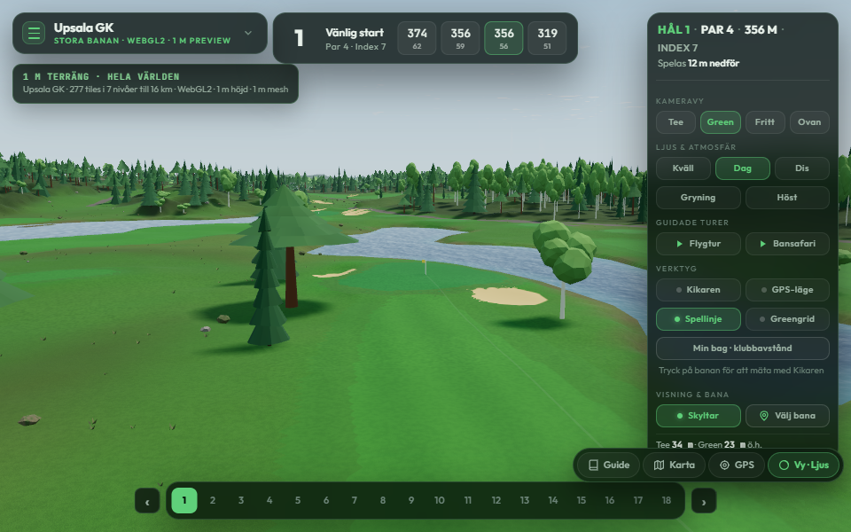
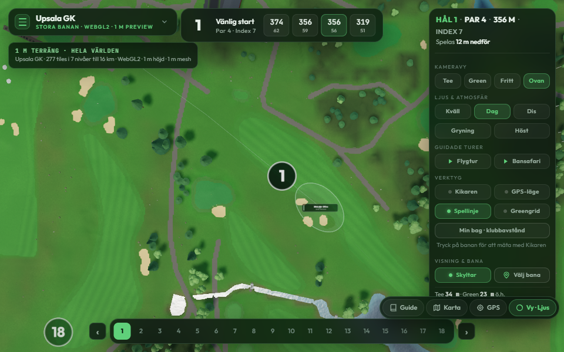

# V2 golf graphics audit and improvement guide

Audited **2026-09-07**, repository checkpoint `8a83a54`, Three.js **0.185.1**.
Scope: all current v2 course graphs and the shared renderer, with detailed Upsala
Stora/Mellanbanan data inspection and selected live Upsala views. This is an
implementation plan; it does not change rendering, geography or MCP settings.

## 1. Recommended direction

Aim for believable Swedish golf landscapes with clear playing surfaces, good
nearby silhouettes and restrained materials. The biggest gains will come from
better surface response, more convincing trees and a few recognizable buildings,
while keeping most of the scene inexpensive and shared between courses.

Implement in this order:

1. Establish hardware baselines and address the **low-quality ring-terrain mesh
   density gap** before adding substantial geometry or texture memory.
2. Fix **Mellanbanan's missing Upsala scenery alias**, then improve ground-edge
   sampling, material scale and close-range microrelief.
3. Improve tree and ground-cover silhouettes within the existing instance/LOD
   systems. Reduce startup work and atlas memory where measurement supports it.
4. Build **one Upsala clubhouse pilot using Blender or the fallback workflow in
   section 9**, with a small reusable material library. Expand to verified bridges,
   stonework and practice assets afterward.
5. Roll out by physical ground, passing desktop WebGPU, desktop WebGL2 and actual
   phone checks independently.

Blender 4.5 is installed locally, but **Blender MCP is not connected in this
session**. Section 9 describes how to make it available and how assets should
enter the application. No new modeling tool is needed for the first material,
sampling and renderer fixes.

## 2. What the audit actually established

The source of current course membership is the
[v2 index](../apps/golf/public/courses/v2-index.json), followed through its active
course and ground manifests. Historical hashed manifests coexist in the repository
and must not be treated as the current release.

| Physical ground / current course slugs | Holes | Terrain tiles / finest tiles | Published tree records | Stand tiles | Parent-linked terrain ring |
|---|---:|---:|---:|---:|---|
| Ängsö: `angso` | 18 | 469 / 256 | 14,991 | 256 | Yes |
| Johannesberg: `johannesberg` | 18 | 85 / 64 | 2,417 | 64 | No |
| Norrfällsviken: `norrfallsviken` | 18 | 469 / 256 | 13,050 | 229 | Yes |
| Puttom: `puttom` | 18 | 277 / 64 | 3,502 | 64 | Yes |
| Ribbingsfors: `ribbingsfors` | 9 | 85 / 64 | 2,293 | 64 | No |
| Upsala: `upsala`, `upsala-mellanbanan` | 18 + 9 | 277 / 64 | 4,181 | 64 | Yes |
| Veckefjärden: `veckefjarden`, `veckefjarden-korthalsbanan` | 18 + 9 | 277 / 64 | 1,821 | 64 | Yes |

These are **nine routings on seven grounds**, not nine independent environments.
Tree counts were decoded from the referenced object chunks; their records are
`tree`, `derived-lidar`, with no botanical subtype. They are not visible-instance
counts or a surveyed stem census. Stand rendering adds representative vegetation.
Johannesberg's separate nine-hole legacy build is not a current v2 index entry.

All seven active ground graphs currently have **zero graph surface tiles**.
V2 terrain therefore does not imply a fully migrated surface/object renderer:
legacy model/GPK1 vectors still supply the semantic ground atlas, buildings,
roads, bridges and other infrastructure. Puttom also has a separate surface
preview path; that does not make every active graph's surface layer authoritative.
Johannesberg and Ribbingsfors require separate frontier/fallback checks because
they do not use Upsala's parent-linked terrain ring.

The existing architecture is already substantial:

- [`main.js`](../apps/golf/src/main.js) uses `three/webgpu` and TSL node materials,
  with `WebGPURenderer` targeting WebGPU or WebGL2. Keep that shared material path;
  WebGL2 support does not require maintaining a second application renderer.
  [Three.js backend documentation](https://threejs.org/docs/pages/WebGPURenderer.html)
- Terrain streaming, batched tile rendering, parent morphs, coarse surroundings,
  exact terrain sampling, instanced trees, geographic tree tiers, cell culling
  and impostors already exist.
- Seamless packed ground detail, surface roughness variation, foliage depth,
  bark UV/alignment, sky-linked water colour, reusable PMREM lighting, stable
  camera updates and shadow stabilization already exist. Improved graphics are
  **on by default for ready v2 terrain**; `graphics=0` is the comparison path.
  The newer [performance recovery report](v2-performance-recovery.md) supersedes
  older preview documents that describe opt-in defaults.

### Live visual evidence and its limits

The local Vite application was inspected at **960 × 600 drawing-buffer pixels,
DPR 1, forced WebGL2, locked `q=lo`, graphics enabled**. This browser reported
`phone:false`; low quality on a desktop browser is not a physical-phone test.
The retained captures use the noon preset and settled terrain with zero loading
or failed tiles. Views inspected: Stora H1 tee, green and overhead, plus H4 green.
Mellanbanan H1 overhead was also booted and checked for terrain readiness.



H1 shows the main opportunities: prominent conifers have tiered cone silhouettes;
broadleaf crowns read as faceted clusters; bunker sand is a largely uniform patch;
water and turf have strong large-area colour separation. The improvement target
is better shape and material response while retaining readable course features.



The overhead view shows stepped path/shore/sand edges and conspicuous repeated
mowing bands. Diagnose source polygon, atlas resolution, filtering and terrain
sampling separately before changing geometry. A screenshot does not establish
which subsystem caused each edge, or whether a real mowing boundary is incorrect.

[The H4 green capture](graphics/v2-visual-audit-2026-09-07/upsala-h4-green.png)
adds a useful hub-facing reference for generic building forms, path material and
nearby tree crowns. These selected views are a visual sample, not a completed
all-hole or all-course appearance review.

## 3. Highest-priority engineering findings

| Priority | Finding in the current implementation | Recommended change and acceptance |
|---|---|---|
| P0 | Low WebGL2 requests `renderStride:2`, but the parent-linked ring adapter does not consume it. | Add an explicit, tested ring mesh-quality policy. Show lower submitted geometry at the same camera/buffer, with unchanged 1 m sampling, no cracks and correct parent morphs. |
| P0 | Device acceptance remains open; existing graphics checks are largely software rendering/component measurements. | Record physical-device baselines before approving new recurring render cost. Include camera motion and prolonged use. |
| P1 | `scenery/index.js` has `upsala` but no `upsala-mellanbanan` alias. | Route both to Upsala's scenery module and compare the same clubhouse from both routings. Follow the existing Veckefjärden short-course alias pattern. |
| P1 | V2 detail decorates colour and roughness, without the legacy terrain material's small-scale bump response. | Add a bounded near-ground micro-normal/bump pilot, preserving terrain normals and filtering detail with distance. Validate both node backends. |
| P1 | Generic hard-surface noise and primitive vegetation/stone silhouettes dominate close views. | Build a small material family and a few instanced shape variants. Replace existing representations rather than adding overlapping detail. |
| P1 | Three species' impostor atlases are generated at startup with the same size on low/high quality. | Compare offline atlases and smaller/cheaper low-quality formats against current startup, appearance and resident memory. |
| P2 | Buildings are efficiently merged but mainly generic; no GLB/KTX2 model pipeline exists. | Introduce one lazy, versioned landmark asset path with fallbacks, then replace Upsala's clubhouse by stable ID. |

### The ring-terrain density gap

**9 September implementation update:** the [terrain optimization pilot](v2-terrain-render-optimization.md) now consumes this option, preserves all finest available leaves, and derives transitions from actual rendered parents. The audit observations below describe the pre-change baseline.

The `renderStride` setting in [`main.js`](../apps/golf/src/main.js) reaches the
fixed-frontier [live adapter](../apps/golf/src/engine/v2-terrain-live-adapter.mjs),
whose [frontier helper](../apps/golf/src/engine/v2-graph-frontier.mjs) decimates the
render payload. In contrast,
[`V2GraphTerrainAdapter.prepare`](../apps/golf/src/engine/v2-graph-terrain.mjs)
does not accept that option. Its
[runtime](../apps/golf/src/engine/v2-terrain-runtime.mjs) creates full-resolution
resources, and the [batch](../apps/golf/src/engine/v2-terrain-batch.mjs) builds
topology from their original dimensions.

In the current H1 tee inspection, the ring reported **37 tiles and 4,925,440
terrain triangles**, exactly 37 × 133,120 for the full 257-sample grid plus skirts.
The sampled whole renderer reported 57 draws and 5,425,587 triangles. This is a
work-count observation, not a frame-rate measurement. The same number of tiles
at a hypothetical 129-sample render grid would have **1,250,304 triangles** with
equivalent skirt topology; that arithmetic is not a measured speedup.

Do not just copy the frontier decimator into the ring path. Its stored parent
height channels were generated for the original lattice. Retaining only even
samples can make those parent values equal the retained fine heights, defeating
the intended transition. A ring implementation must recompute render-parent
targets and geometric-error assumptions, preserve shared borders/skirts, and
test mixed levels, morphing and terrain contacts. Keep the full 1 m CPU height
source. Treat visible grass/water/object contact disagreement as a failed pilot.

Also inspect the selection policy: the app sets WebGL2 screen error to 1.5 pixels
for both qualities, overriding the package's coarser mobile default. Active-hole
requirements can exceed nominal selection limits. Adjust screen error, active
coverage and render topology together from measured image error; a tile-count
cap alone is not a memory or triangle budget.

## 4. Upsala: improve the actual shared ground

Use [the current mapping handoff](../upsalabuild/mapping/NEXT-SESSION.md),
[scope ledger](../upsalabuild/mapping/scope.json),
[model vocabulary](course-model-vocabulary.md) and
[mapping workflow](v2-course-mapping-workflow.md) for evidence and authoring paths.
Rendering improvements must not silently create new geographic claims.

| Area | Current evidence / representation | Visual improvement |
|---|---|---|
| Shared clubhouse `w221193965` | Upsala has cream walls, orange-brown roof, estimated height 4.4 m and one window row. Mellanbanan currently falls back to generic colours, 5.4 m and two rows. | Fix the scenery alias first. Then model recognizable roof breaks, entrance/gables and facade proportions from dated references; keep the accepted footprint. |
| Practice hub | 53 facility records include 30 individually mapped mats, four practice greens, six targets and an exact path polygon. Some dimensions/materials remain unknown. | Make this the material pilot: synthetic turf/rubber, compacted surfaces, trim and restrained wear. Preserve individual mat rings and the practice-green interior exclusion. |
| Roads and parking | Seven parking lots; 26 roads, 131 tracks, 22 paths. Many have unknown material. The 116.240 m² practice path is explicitly `unverified-hard-surface`. | Improve verified asphalt/gravel now. Keep unknown material as a display default. Review junctions, islands and widths from evidence before changing topology. |
| Municipal road evidence | 148 open road edges, of which 120 have usable method/accuracy metadata; 28 have unknown/50 m accuracy. | Use eligible edges to review actual closed surfaces. Do not buffer every edge into another road. |
| Bridges | Four horizontal deck footprints; the southern bridge still needs approach and vertical-dimension review. | Resolve approaches and height/rail evidence, then use a shared modular bridge material/mesh family. |
| H3 stonework | Authored description mentions a curved stone wall by green/water; no dedicated Upsala wall renderer establishes it. | Identify the correct source line, dimensions and photographs, then use modular wall geometry with baked stone detail. Do not invent a boulder rim. |
| Greens, tees and fairways | Stora has 54 tee records, 52 imagery-reviewed; Mellanbanan has 24. Some census/hidden-outline questions remain open. | Improve cut/material contrast without flattening terrain, enlarging tees or moving markers. Preserve H4's split fairway and Mellan H8's path gap. |
| Sand | Both views represent the same 84 conventional sand records under different hole/scenery ownership, with additional facility sand represented separately. | Improve sand scale and perimeter shading once, shared between routings. Mellanbanan's zero played-hole bunker count is not a missing-sand bug. |
| Woodland | 4,181 published crown candidates, 228 separate OSM points and 50 municipal observations. | Preserve published identity/placement. Improve plausible broadleaf/conifer shapes; do not add three overlapping tree populations or claim botanical species from coarse context. |
| Background buildings | 444 footprints, mostly shared procedural/merged representation. | Keep generic background buildings inexpensive; spend bespoke modeling effort on recognizable near landmarks. |
| Boundaries and drainage | 19 typed boundary lines and four additional ditch lines remain evidence/GIS observations. | Obtain height, profile, identity and material before rendering walls, fences, hedges or channels. |
| Halfway House | Current handoff has a reported 7.2 × 6.4 m plan but no defensible geographic footprint. | Keep placement pending evidence; do not relabel nearby rectangles to make a convincing scene. |

Preserve the deliberate absence of invented fairway strips on Stora par-3 holes
H2/H6/H14 and H10. The generated 3.2 m green fringe, 2.2 m tee fringe and 4.5 m
fairway semi-rough band are appearance defaults, not measured mowing classes.
Neither imagery resolution nor a detailed Blender mesh proves surveyed geometry.

Upsala's compatibility heights were rebuilt from the same RH2000 terrain and its
configured vertical offset is zero. Keep that shared height contract. A visual
pass must not apply another course's offset, sculpt green contours, excavate
bunker floors or change water levels to improve shading.

## 5. Ground materials: grass, sand, gravel, stone and roads

Start in [`material.js`](../apps/golf/src/engine/material.js) and
[`ground-detail-texture.mjs`](../apps/golf/src/engine/ground-detail-texture.mjs).
Current v2 surface detail uses four samples from one packed 512² DETAIL texture.
It already modulates colour and roughness. Preserve that inexpensive base and
introduce richer material response only where pixels can show it.

| Surface | Technique to prototype | Phone / distance policy |
|---|---|---|
| Putting green | Fine, low-amplitude micro-normal; restrained directional cut response; quiet colour variation. | No modeled blades. Fade detail before it shimmers. Preserve ball/flag readability. |
| Tee and fairway | World-scale short-turf grain, per-polygon mowing orientation and broad low-contrast variation. Filter stripe edges instead of sharpening them. | Reuse existing packed channels first. Thin detail fades to the same mean colour. |
| Semi-rough / rough | Distinct fibre scale and roughness, irregular clump distribution; a few small grass clusters at visible edges. | Material detail at range; near clusters only in small spatial cells. None across maintained turf/paths. |
| High grass / meadow | A few grass-head silhouettes, height/tint variation, light wind in the vertex stage. | Separate documented display treatment from mapped extent. Avoid full-property blade carpets and layered transparent shells. |
| Bunker sand | Fine grain normal, subtle broad rake-direction variation and muted warm/cool variation. | No grain geometry. Keep mobile sample count small; rake patterns are artistic unless sourced. |
| Bunker perimeter | Stable material transition and restrained edge darkening; lip geometry only where a profile is known. | No course-wide displacement or dark fake trench. Preserve the sand outline and terrain sampler. |
| Gravel / compacted aggregate | Physically plausible aggregate size, packed roughness/normal, subdued wheel wear and an earth/verge transition. | Small shared tileable map; only a few foreground stones where permitted. Never model every pebble. |
| Asphalt / paved road | Lower-frequency mottling, fine aggregate and low-contrast roughness; markings only where recorded. | One opaque material. Reuse mapped surface coverage instead of another coplanar ribbon. |
| Dirt / worn path | Compacted centre with irregular colour/roughness and restrained verge transition. | Stable masks and low-frequency variation; do not infer ruts or change route width. |
| Granite / exposed rock | Broad colour bands, fissure normals, roughness variation; mesh shape only for silhouettes. | Shared normal/roughness family. Triplanar projection only where UVs are unsuitable and its extra samples are justified. |
| Stone walls / riprap | Modular low-poly silhouette plus baked small stone relief and crevice AO. | Merge/instance modules; simplified distant profile. Do not use displacement to manufacture wall height. |
| Practice mats | Fine synthetic-turf response and separately verified rubber/edge material. | Shared atlas, no assumed slab thickness or new platform height. |

### Sampling and shading rules

1. **Keep geography separate from appearance.** Use world coordinates and stable
   surface IDs so detail does not swim as tiles or cameras move. Share appearance
   assets between Stora/Mellanbanan without duplicating their physical surfaces.
2. **Diagnose edges before raising resolution.** Capture class/SDF diagnostics
   where supported, compare the accepted polygon with the current atlas, then
   inspect magnification/minification and transition widths. Use analytical
   antialiasing or distance-field coverage when supported by the actual path.
   Do not apply linear filtering to raw class IDs, lossy compression to semantic
   labels, or aesthetic smoothing to an accepted footprint.
3. **Add microrelief carefully.** Perturb the decoded/interpolated terrain normal
   in the correct space; never replace it with a flat material normal. Derivative
   operations are additional fragment work even when existing texture samples can
   be reused. A distance multiply does not necessarily eliminate shader sampling:
   use explicit tier variants when the low tier must avoid that cost entirely.
4. **Control repetition without uncontrolled sample growth.** First use world
   scale, per-surface mowing direction and low-frequency tint. Test multi-sample
   stochastic tiling only on a bounded higher-quality material if repetition is
   still visible. Keep tile-border evaluation continuous.
5. **Keep colour management consistent.** Albedo/emissive textures use sRGB;
   normal/roughness/occlusion data use non-colour encoding. Avoid compensating for
   wrongly decoded assets by changing exposure. [Three.js colour workflow](https://threejs.org/manual/en/color-management.html)
6. **Choose neutral albedo.** No photographed cast shadows or baked direct sun
   in ground maps. Raw orthophoto remains measurement input, as required by the
   [runbook](v2-course-runbook.md), rather than the shipped ground appearance.

## 6. Trees, grass geometry and landscape composition

### Improve the existing tree system

There are already three procedural tree families and hero/full/decimated/impostor
tiers. Default `lodmode=zone` is deliberately geographic: distances from the
hole corridors select bands at approximately 90, 300 and 700 m. High quality
uses tiers `[1,2,3,4]`, low quality `[2,3,4,4]`. Screen-size selection and dithered
transitions exist as alternatives, not the default policy.

Keep those stable zone assignments initially. Improve the meshes used inside
them: less regular conifer whorls, varied trunk-to-crown proportions, asymmetric
broadleaf crowns, readable branching and a few shape-matched variants. Details
must be visible in the low-quality tier, since normal phones do not receive the
highest hero tier. Do not increase the tree population to make a better model
look dense.

Preserve the existing instancing and cell culling: retain per-cell visibility,
then compact visible instances into shared template/material/tier batches. Avoid
turning each tree cell into another draw. For new ground cover, compare smaller
cell batches against their draw overhead. Instancing still pays
for visible vertices and covered pixels. [Three.js InstancedMesh contract](https://threejs.org/docs/pages/InstancedMesh.html)

Alpha-card foliage is a separate style/performance experiment. Earlier sprig
cards were explicitly rejected in the source's visual history. Test one coherent
tree family before revisiting them; inspect silhouette, leaf coverage in mipmaps,
shadow density, grazing angles and overdraw. Alpha testing still has fragment
cost. Keep optional alpha-to-coverage capability-tested; do not make portable
foliage depend on one backend's MSAA behaviour.

### Treat the tree and its impostor as one asset

[`tree-impostor.mjs`](../apps/golf/src/engine/tree-impostor.mjs) currently bakes
8 × 8 views at 96 pixels per frame into two 768² RGBA HalfFloat mipmapped targets
per species. Three species mean six colour targets: approximately **36 MiB**
including their mip chains, before depth buffers/driver overhead. There is no
low-quality atlas-size override in the current startup caller.

Prototype versioned offline albedo/coverage and normal/crown atlases, with an
explicit low-quality option. Compare transfer bytes, decode time, startup and
resident memory against runtime baking; offline assets are not automatically
faster. Investigate removal of bake-only depth resources after baking, or lower
precision formats, with backend-specific validation.

The current baker substitutes vertex-colour/flat trunk materials and face-derived
normals. It does **not** capture arbitrary textured GLB trees correctly. A Blender
tree must update its near material and atlas generation together, preserving the
hemisphere frame convention, centre/radius, alpha coverage, crown mask, seasonal
tint and fade/wind contract. Check all tiers side by side and in motion.

### Keep ground cover local and inexpensive

Current tufts are three triangles; bushes, stones and stumps use simple primitive
forms in `main.js`. Improve a small variant library, then manage instances in
terrain cells rather than adding a giant always-visible collection. Initial
experimental ranges: roughly 10–20 m for detailed phone clumps, 30–50 m desktop,
with earlier removal in overhead views. These are tuning starting points.

Use grass masks, slope and ground material to exclude greens, tees, fairways,
roads, paths, parking and water. Avoid new large obstacles in the playing area.
Stable seeded variation should change appearance only, not evidence-backed
tree/boulder identity. Use bounded shader wind with consistent amplitude across
LODs; update no per-blade matrices each frame and respect reduced-motion settings.

For the wider landscape, improve meadow/forest colour separation and distant
silhouettes before adding geometry. Keep the 16 km terrain/horizon relationship
continuous on ring grounds. Use restrained atmospheric depth to separate planes;
fog must not conceal terrain seams or erase the golfer's target.

## 7. Lighting, shadows, water and post-processing

Keep the existing sun/sky system, ACES output, environment reuse and shadow
stabilization as the baseline. The next lighting pass should balance materials
across noon, golden, mist, dawn and autumn before introducing another effect.

- **Lighting:** use the existing directional sun plus sky fill. Tune albedo,
  exposure and light balance together against the same reference views. Add
  restrained material-level contact/crevice AO for assets; do not bake a fixed
  sun shadow into textures that must survive preset changes.
- **Shadows:** current low/high shadow maps are 1024²/2048². Improve useful shadow
  placement and caster selection before increasing their size. An independent
  conservative light-frustum/caster LOD could reduce work, but retain off-camera
  objects that cast onto the visible scene. Keep existing snapped fits and cache
  invalidation. New grass does not need individual long-distance shadow casting.
- **Water:** existing single-pass flat water where the render policy permits it,
  and palette-linked reflections, already provide the foundation. Masked batches
  intentionally retain two passes. Tune wave/normal scale, highlight intensity and
  shoreline transition; lakes, small ponds and streams should not share one
  exaggerated ripple scale. Keep water meshes/levels and islands unchanged.
  Use shore-distance information for restrained appearance, not invented depth
  or bathymetry. Preserve the existing depth/write policy until equivalent
  coverage has been checked on both backends.
- **Reflections:** retain stable `scene.environment` identity and the reusable
  lighting baker. Avoid per-frame PMREM or reflection probes. Planar reflections,
  SSR and refraction passes are later desktop experiments with explicit budgets,
  never part of the phone baseline.
- **Post-processing:** keep bloom restrained and optional; low-quality WebGL2
  currently has no bloom chain. Do not make SSAO/GTAO, volumetric clouds, depth of
  field, motion blur or real-time GI prerequisites for a good-looking course.
  First test asset contact shading and sky balance, which also work on phones.
- **Antialiasing:** the current renderer uses 4× MSAA and HalfFloat output. Compare
  sample count/output format only as a measured quality option, including foliage
  edges, highlights, banding and render-target memory. A smaller buffer is a
  quality reduction and must be reported as such in performance comparisons.

Relevant source entry points are
[lighting environment](../apps/golf/src/engine/lighting-environment.mjs),
[water lighting](../apps/golf/src/engine/water-lighting.mjs),
[water policy](../apps/golf/src/engine/water-render-policy.mjs) and the
[shadow stability report](v2-terrain-shadow-stability-preview.md).

## 8. Performance budgets and quality tiers

These are **proposed pilot targets**, not demonstrated current performance or
universal device limits. Establish named baseline devices first. A change must
also preserve matched baseline performance within measured run-to-run variation;
meeting a generous ceiling does not justify making an already-fast view slower.

| Metric / policy | Phone baseline, WebGL2 | Desktop baseline, WebGL2 and WebGPU tested separately |
|---|---|---|
| Sustained frame target | 30 FPS; median ≤33.3 ms, p95 ≤40 ms, p99 ≤50 ms | 60 FPS; median ≤16.7 ms, p95 ≤20 ms, p99 ≤33.3 ms |
| CPU work target | Main-thread work p95 ≤8 ms, measured separately from rAF interval | Main-thread work p95 ≤6 ms |
| Diagnostic draw ceiling | Aim ≤120 submitted draws for a representative frame | Aim ≤200; account for shadows and extra passes |
| Diagnostic geometry ceiling | Aim ≤1 million submitted triangles after terrain work | Aim ≤3 million; use higher only with measured headroom |
| Tracked renderer-resource target | Aim ≤256 MiB total; textures initially ≤96 MiB | Aim ≤512 MiB total; textures initially ≤192 MiB |
| Added first-view model package | ≤0.5 MiB compressed, preferably deferred until first useful terrain | ≤1.5 MiB compressed; detail still loaded by visibility/need |
| Shared texture size | Start 512–1024; 2K only when justified by screen coverage | Start 1K; selected 2K near assets, no blanket 4K library |
| New recurring effects | Opaque material response, bounded cover and existing shadows | Same baseline; optional effects only after timing evidence |
| Resolution | Preserve actual buffer in A/B; existing low DPR is 1 | Preserve actual buffer in A/B; current high cap is DPR 2 |

The new diagnostic ceilings are deliberately below some current work counts:
the observed H1 tee is about 5.43 million renderer triangles, and initial tracked
resource memory was 320,322,705 bytes (about 305.5 MiB). A later H4 view after
camera/preset changes reported 332,322,617 bytes (about 316.9 MiB). Different
residency/history prevents calling that increase a leak. It does justify a
repeatable residency and disposal test before adding textures.

For context only, the [September 6 recovery fixture](v2-performance-recovery.md)
used 384 × 288 software WebGL2 and recorded 93 draws, 1,153,299 triangles and
309,545,450 initial tracked bytes. Those camera/buffer/history conditions differ
from this audit and cannot establish a performance regression or phone budget.

Count decoded CPU payloads, GPU attributes, mipmapped textures, shadow targets,
MSAA/resolve buffers, staging resources and temporary decoder peaks separately.
`renderer.info` is useful resource accounting, not total browser RAM or physical
VRAM. One uncompressed 1024² RGBA8 map with full mips is about **5.33 MiB**;
three such maps use about **16 MiB**, regardless of small PNG/JPEG download sizes.

Keep extensions optional, bound uploads/decoder concurrency, avoid synchronous
GPU readbacks in normal frames and release unused resources. Browser limits and
compressed formats vary by device. [MDN WebGL performance guidance](https://developer.mozilla.org/en-US/docs/Web/API/WebGL_API/WebGL_best_practices)

A future runtime quality controller should use sustained timings and hysteresis,
then reduce optional cover, costly material variants and shadow work before
silently rebuilding the entire scene. Current automatic fallback mainly lowers
DPR/disables bloom; it does not immediately rebuild already allocated geometry.
Do not implement a quality menu that claims to free resources it retains.

## 9. Blender MCP and the asset production workflow

### Connection status and optional setup

The read-only environment check found Blender 4.5 at:

```text
C:/Program Files/Blender Foundation/Blender 4.5/blender.exe
```

No Blender tools are exposed in the active tool catalog, no Blender MCP entry was
found in the checked Codex configuration, and no Blender process/default-port
9876 listener was observed. `uvx` and `blender` were not on this shell's PATH.
This does not determine whether an addon exists in another Blender profile.

For future modeling, the community
[ahujasid/blender-mcp project](https://github.com/ahujasid/blender-mcp) is a candidate.
It consists of a Python MCP bridge and a Blender addon with a local socket server;
it is not an official Blender/OpenAI integration. Select a specific reviewed
release/commit and matching addon rather than an unpinned moving installation.

1. Install the selected bridge and matching addon; enable the addon in Blender.
2. Open a dedicated asset-authoring `.blend` and start the addon's local server.
3. Register the resolved server executable with Codex. The CLI command shape is
   `codex mcp add blender -- <resolved-server-command> <server-arguments>`.
   For uvx, use its real absolute executable path and a pinned package version.
   The placeholders here require resolution; they are not a ready-to-run command.
4. Reload the Codex client if needed, confirm that Blender tools appear, then
   request a read-only scene listing/version check before any modeling.
5. Save `.blend` source and exports through the asset workflow below. Keep the
   bridge local; connected Python execution has the privileges of Blender.

Codex supports local stdio MCP configuration shared by CLI/IDE.
[Official MCP setup documentation](https://learn.chatgpt.com/docs/extend/mcp?surface=cli)
No installation or configuration change was performed for this documentation task.

### If Blender or Blender MCP is unavailable

**Continue the graphics work. Blender is an optional authoring tool, and MCP is
an optional way to control it.** Neither is a dependency of the shipped app.
Choose the available route rather than waiting for a connection:

| Available access | What to do | Editable deliverable |
|---|---|---|
| Blender installed, MCP unavailable | Use Blender's normal interface or a checked-in Python generation/export script through its background command line. | Script, `.blend`, explicit LODs and exports; same asset manifest and checks as the MCP route |
| No local Blender, but an artist or another workstation has it | Prepare a reference packet with accepted footprint, dimensions/confidence, pivot/orientation, material limits and LOD budgets. Receive and validate exports in the app. | Reference packet, authoring source and GLB/texture package; no remote access is required |
| No Blender access anywhere | Improve the existing Three.js procedural geometry and materials. Use licensed, compatible model/texture files only where they add value. | Seeded geometry generators, parameter records, texture sources and optional imported assets |

For the locally installed Blender 4.5, the background/script flags were verified
with the executable's `--help`. After creating the proposed script below, this
PowerShell command can generate assets without MCP or an interactive window:

```powershell
& 'C:/Program Files/Blender Foundation/Blender 4.5/blender.exe' --background --factory-startup --python-exit-code 1 --python 'tools/assets/build-upsala-clubhouse.py'
```

`tools/assets/build-upsala-clubhouse.py` is a **proposed file, not an existing
tool**. Implement it to read the reviewed asset parameters, construct explicit
LODs, save a new source `.blend`, export the model and report dimensions/materials/
triangle counts. It must choose its output paths explicitly and preserve existing
authored files. Background Python execution is also documented by
[Blender's developer handbook](https://developer.blender.org/docs/handbook/testing/python/).
Do not report a Blender render/export as completed until it has actually run.

When Blender itself is unavailable, use this implementation sequence:

1. **Finish renderer and material improvements first.** The ring-terrain density
   fix, scenery alias, surface-edge sampling, TSL microrelief, lighting balance,
   culling and memory work need no Blender. Continue using the existing packed
   detail texture, or introduce a small licensed PBR set under the same budgets.
2. **Upgrade simple shapes directly in Three.js.** Extend the existing building
   generator with reference-backed roof sections, entrance trim and facade
   proportions. Build modular bridge/wall pieces and seeded rock/plant variants
   with `BufferGeometry`, primitives and, where suitable, `ExtrudeGeometry`.
   Disable unwanted bevels, orient extrusion into the app's world frame and check
   the result against the accepted footprint.
   [Three.js extrusion documentation](https://threejs.org/docs/pages/ExtrudeGeometry.html)
3. **Retain the efficient rendering structure.** Share materials, merge static
   pieces and instance repeated shapes. Provide explicit simpler meshes; avoid
   one mesh/material per roof tile, gravel stone or grass blade. Tree changes
   still need matching impostors and the existing geographic tier policy.
4. **Keep procedural assets as code when practical.** A GLB is optional for an
   asset already built efficiently in the app. If a reusable file is needed,
   add an offline/browser authoring harness using `GLTFExporter` with binary
   output. Export supported standard materials and baked textures; arbitrary TSL
   shader graphs do not become portable glTF materials automatically.
   [Three.js GLTFExporter](https://threejs.org/docs/pages/GLTFExporter.html)
5. **Validate imported assets before adoption.** Check redistribution rights,
   scale/orientation, appearance, explicit LODs, materials and texture memory.
   Imported models still require the optional loader/cache pipeline below.
   Generic assets cannot establish Upsala's building shape or object placement.

For the clubhouse pilot, a procedural roof/facade upgrade can complete the first
iteration while detailed organic modeling or texture baking waits for suitable
tools. Keep stable asset/object IDs and the same budgets so a later Blender model
can replace that representation without changing geography. Preserve editable
generator scripts and parameters when there is no `.blend`; retain the same
reference, licence, bounds and performance records for either route.

### What to model first

Budgets below are asset-production starting points, subordinate to the whole
scene budgets and the amount of screen space each asset occupies.

| Asset | Near / fallback triangle target | Material/texture target | Placement prerequisite |
|---|---|---|---|
| Upsala clubhouse | 8–15K near desktop; 2–4K phone/distant | 2–3 materials; start with a shared 1K atlas | Accepted footprint plus reference-backed roof/facade dimensions |
| Granite/boulder family | 150–500 / 40–100 each; 3–5 variants | One shared material family | Existing permitted stones; new large boulders require evidence |
| Grass/reed/low shrub family | Approximately 12–80 triangles for small clumps; separate shrub budget | One shared atlas per compatible family | Semantic exclusions and bounded instance count |
| Verified bridge/gate/shelter | 300–2K per small object, simpler distant form | 1–2 materials, shared timber/metal | Identity, footprint and vertical dimensions |
| Practice details | Budget by actual screen size; instance repeated pieces | Shared turf/rubber/paint | Preserve individually mapped mats/pads |
| Tree family pilot | Match or reduce the replaced tier's total work first | Shared bark/foliage and matching impostor | Preserve existing crown transforms and uncertainty |

Keep distant buildings procedural and merged. Defer generic cars, furniture and
equipment when mapped-only placement does not permit them. A high-quality stock
asset is not evidence that the object belongs on this course.

### Authoring and export contract

- Author local geometry in **metres**, close to the origin. Set a deliberate
  terrain-contact pivot, apply transforms, check dimensions/normals and include
  a labelled orientation fixture. For Blender-authored assets, let glTF export
  convert Blender's Z-up orientation once. Procedural app geometry uses the
  app's world directly: up `+y`, east `+x`, north `-z`.
- Keep EPSG:3006/RH2000 placement and stable geographic IDs in placement metadata,
  not giant vertex coordinates. Use the existing geodetic bridge and terrain
  sampler. A bridge/raised structure needs its explicit height treatment rather
  than grounding every vertex to the terrain.
- For external model packages, export `.glb` with a small metallic-roughness
  material set; procedural assets may remain repository-native geometry code.
  Bake tool-specific procedural details to portable textures when exporting;
  use tangent-space normals, crevice AO
  and appropriate occlusion/roughness/metalness channels. Avoid baked direct sun.
  Blender's bundled exporter is maintained in the
  [Khronos glTF Blender project](https://github.com/KhronosGroup/glTF-Blender-IO).
- Deliver explicit lower-detail meshes. GLB loading does not automatically create
  or select the application's LOD tiers. Review material slots as carefully as
  triangles: every extra primitive/material can increase draw work.
- Retain editable source (`.blend` when used, otherwise generator scripts or the
  authoring tool's native source), texture sources, exports where applicable and
  an asset manifest recording ID/version, intended physical object, dimensions, pivot, orientation, bounds,
  LOD counts, materials, map sizes, references, confidence and redistribution
  licence. Keep third-party attribution with the shipped asset where required.

Example Blender MCP task once connected:

> Read the selected Upsala clubhouse reference packet and approved local footprint.
> Build the roof/entrance silhouette within that footprint in metres. Keep uncertain
> dimensions explicitly marked in the asset notes. Produce near and low-detail
> meshes, at most three shared materials and a 1K pilot atlas. Preserve the ground
> pivot, export GLB, and report dimensions, bounds, triangles and materials for each
> tier. Do not add new buildings, vegetation or terrain.

### Integrate one optional model package

There is currently no application `GLTFLoader`, `KTX2Loader` or meshopt import.
The existing course asset loader verifies BVCH geography; it is not a GLB loader.
Introduce a separate, lazy appearance-asset registry with explicit links to
physical object IDs. Proposed paths such as `assets-src/golf/` and
`apps/golf/public/assets/golf/` are new design choices, not existing pipelines.

1. Exclude the selected landmark by stable ID from the monolithic building merge
   and retain its procedural fallback as a separately hideable group. Load that
   fallback first, request the GLB only when needed, then swap groups atomically
   once the verified asset is ready. A merged mesh cannot simply have one building
   removed by ID; an explicit batch rebuild is the alternative. Never draw both.
2. Configure a lazy `GLTFLoader` with meshopt and KTX2 support where used. Initialize
   renderer support detection before KTX2 transcoding. Measure actual formats and
   transcode time on both backends. [GLTFLoader](https://threejs.org/docs/pages/GLTFLoader.html),
   [KTX2Loader](https://threejs.org/docs/pages/KTX2Loader.html)
3. Simplify meshes before compressing them. Meshopt reduces encoded transfer data;
   it does not by itself reduce rendered triangles. Benchmark a pinned offline
   optimization/export toolchain, for example
   [glTF Transform](https://gltf-transform.dev/cli).
4. Share/reference-count materials, geometry and textures across instances and
   both Upsala routings. Bound concurrent decode/upload work; dispose after final
   release and close source image bitmaps when appropriate.
   [Three.js resource cleanup](https://threejs.org/manual/en/cleanup.html)
5. Extend [Vite/PWA handling](../apps/golf/vite.config.js) deliberately: base-path-safe
   hashed GLB/KTX2/decoder URLs, finite runtime caches, honest missing-file responses
   and an offline fallback. Do not precache every course's new models at install.

## 10. Course-by-course rollout

These priorities combine current data/scenery inspection with proposed review
scenes. Only the selected Upsala scenes above received live visual inspection.

| Ground | Visual focus | Specific regression/stress check |
|---|---|---|
| Upsala + Mellanbanan | Shared cream clubhouse, practice hub, grass/sand/path response, H3 stonework after source/height verification and bridge approaches | Same physical hub from both routings; no duplicate surfaces, buildings or trees |
| Ängsö | Red clubhouse courtyard, H5 aiming house, castle/church sightlines, juniper/broadleaf variation | Largest published tree-record population; verify distant landmarks survive simplification |
| Norrfällsviken | Bare rock/shore material, chapel silhouette, marina models and restrained water | Dense forest plus coast; alpha overdraw, shoreline and terrain-level transitions |
| Puttom | Red glazed-gable clubhouse, roof/trim, range/yard surfaces, forest-edge detail | Forest load and startup; retain its useful implementation tests without assuming complete survey |
| Ribbingsfors | Pale-yellow timber clubhouse, tile roof and path joins | Frontier/fallback horizon, nine-hole harness coverage |
| Johannesberg | Distinguish red golf clubhouse from white manor/hotel; hub and meadow treatment | Frontier/fallback terrain and identity of background buildings |
| Veckefjärden + short course | Granite/riprap, water edge, alder-like woodland shapes, existing skyline landmarks | Water load, H14 armour and shared short-course scenery alias |

For Upsala's next full review, capture the hub from both slugs; Stora H3
green/wall/water, H4 crossing, H7 forest edge, H8 Sahara sand, H10 downhill view and
H16 green-sand boundary; Mellan H6 stream and H8 path split. Add close, overhead
and moving views rather than judging only sunset screenshots.

## 11. Delivery phases and acceptance

| Phase | Concrete deliverable | Acceptance before advancing |
|---|---|---|
| A: baseline and consistency | Named hardware reports; ring-density investigation/prototype; Mellan scenery alias | Matched geography/buffer/cameras, stable shadows and parent transitions; measured performance headroom or an explicit remaining deficit |
| B: surface pilot | One shared material family at the Upsala hub and representative turf/sand/water edge | Better near and overhead appearance on low WebGL2; no shimmer, boundary movement, extra layers or unexplained memory increase |
| C: vegetation pilot | One improved tree family and small cover/stone variants; offline-atlas experiment | Low/high tiers and impostors agree; same geographic population; bounded overdraw, startup and residency |
| D: landmark pilot | Clubhouse source, explicit LODs, appearance manifest and fallback; lazy loading for external model files | Same building in both routings, no duplicated merged geometry; bounded materials/memory; correct orientation and terrain contact |
| E: distinctive assets | Evidence-ready wall/bridge/practice assets, then other grounds' landmarks | Per-object reference review plus whole-course device budget checks |
| F: rollout | Per-ground captures, hardware results, cache/offline checks and rollback reference | Both desktop backends and physical phones pass; no unmeasured higher tier becomes a required baseline |

Keep each phase independently reviewable. Material-only changes should preserve
course/ground data fingerprints. Geographic corrections follow the mapping
workflow and rebuild affected artifacts; do not hide them in a visual patch.
Retain existing placement, tee, shared-surface, infrastructure and height checks.
Add targeted tests only for new contracts such as ring decimation/morphs, model
ownership, decoder fallback and resource release.

## 12. Reproducible validation

### Rendering checks

Run the app from `apps/golf` with `npm run dev`, or serve a production build for
repeatable capture. Review the unified app, not `upsala3d.html`, whose rendering
path is separate. Example forced-WebGL2 view:

```text
http://localhost:5173/?bana=upsala&v2=require&gl=1&q=lo&qualitylock=1&hal=3&vy=green&ljus=dag
```

Use `vy=ovan` for an overhead URL; the graphics harness calls this view `top`.
Remove `gl=1` to allow WebGPU selection, then verify the actual backend. Use
`graphics=0` only to compare the existing polish path; new experiments need their
own explicit feature switches/baseline builds.

The existing software image harness can capture matched views:

```powershell
node tools/v2-graphics-review.mjs --base http://127.0.0.1:5173 --out .tmp/graphics-before --course upsala --backend webgl2 --q lo --graphics default --views 1:tee:noon,3:green:noon,4:top:noon --width 960 --height 600
node tools/v2-graphics-review.mjs --base http://127.0.0.1:5173 --out .tmp/graphics-after --course upsala --backend webgl2 --q lo --graphics default --views 1:tee:noon,3:green:noon,4:top:noon --width 960 --height 600 --compare .tmp/graphics-before/report.json
```

Run the first command against the baseline and the second against the changed
build. This harness **forces software rasterization**, even when its backend
option says WebGPU. It checks images, readiness and data consistency, not hardware
FPS. Moving shadows, water, LOD changes and low-angle texture aliasing also need
short matched motion captures.

### Hardware checks

The existing desktop harness requires explicit hardware mode:

```powershell
$env:BANVY_GPU = '1'
node tools/frame-time.mjs http://127.0.0.1:5173 --course upsala --frames 900 --warm 120 --query 'gl=1&q=lo&qualitylock=1' --out .tmp/upsala-webgl2-hardware.json --label baseline
```

Verify its recorded adapter; do not accept software rendering as hardware because
an environment variable was set. The harness currently has a fixed 1920 × 1080
viewport, desktop views including H12/H14, and median/p95/max output. **Extend it
for p99, phone viewports and nine-hole-safe view lists before making those claims.**
Its uncapped rAF timings should be compared only with the same harness settings;
also test normal, vsync-paced interactive use. Missing GPU timing support is a
missing metric, not a zero-cost GPU frame.

This harness also hardcodes `det=1`, freezing shader clocks and disabling tree
fades. Its moving-camera `gpuMsAfter` sample is taken after motion. Use normal
animated recordings and synchronized GPU samples during motion to assess live
water, wind, fades and moving-frame GPU cost.

Required matrix: integrated-GPU desktop WebGL2, desktop WebGPU, a named Android
Chrome phone and a named iPhone/Safari using WebGL2. Record model, OS/browser,
actual backend, buffer/DPR, quality, course/ground hashes and feature switches.
Mobile emulation cannot validate phone GPU limits or Safari behaviour.

For each candidate, use at least three alternating baseline/candidate runs:

- Cold/warm startup to first useful view, including optional model decoding and
  first shader use; compare under the same network/cache conditions.
- Resting and moving cameras near grass, forest, water and the clubhouse;
  median/p95/p99 intervals, GPU timing where supported and hitches over 50/100 ms.
- First and repeated noon/autumn/golden switches, fast alternation and return to
  an earlier hole. Check shader rebuilds, resource plateaus and visual continuity.
- Ten to fifteen minutes on each phone, including background/resume and rotation;
  check sustained performance, thermal degradation, context loss and recovery.
- Reload/offline reopen, optional-asset failure and course switching. Confirm
  that models remain optional and shared-ground assets are not retained twice.

Useful existing instrumentation: `V3D.quality()`, `rendererInfo()`, `frameTimes()`,
`perf()`, `v2Terrain()`, `v2Plan()`, `v2TerrainBuffers()`, `treeLodPx()` and
`lightingEnvironment()`. Record counters at a consistent completed-frame point;
separate startup totals from per-frame draws and CPU submission from GPU duration.

For a rendering implementation, run the relevant material/terrain/placement tests,
the application production build, applicable lint and the runbook's renderer/app
checks. Review actual images against course references after automated checks.
For this documentation-only audit, no runtime fix, asset import, hardware
acceptance or Blender connection is claimed.
