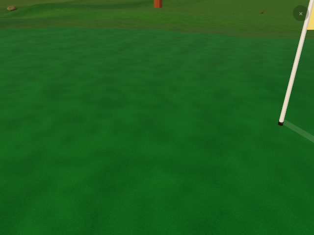
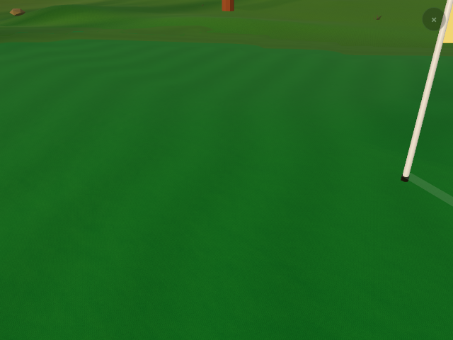
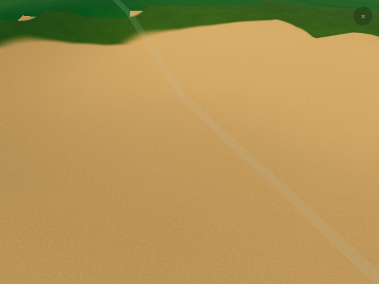
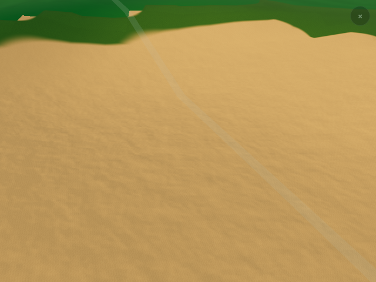
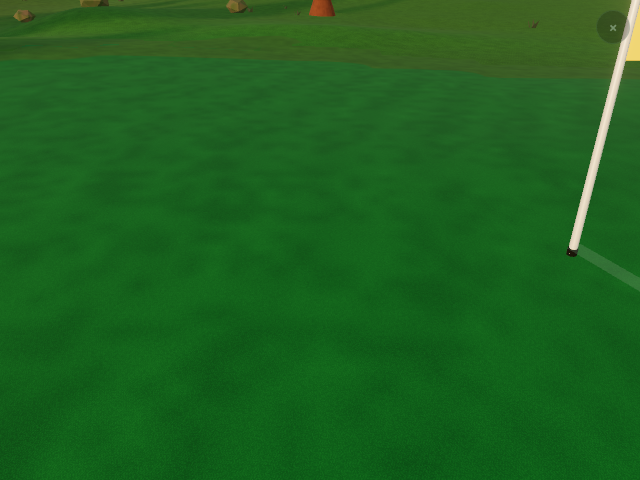
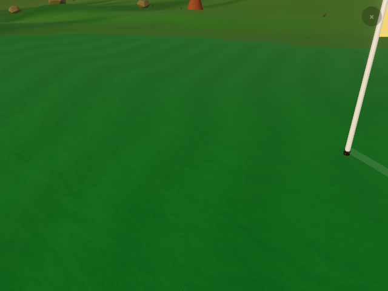
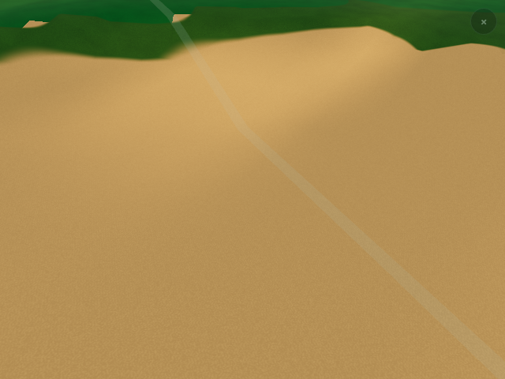
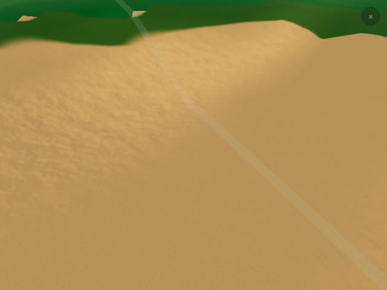

# Ground material relief pilot — 9 September 2026

This implements the close-range microrelief item in the [graphics improvement
guide](v2-graphics-improvement-guide.md), following the [terrain render
optimization](v2-terrain-render-optimization.md). The pilot adds light-responsive
turf clumps and sand texture, with a smoother response on putting greens. It
uses the existing packed detail texture and needs no Blender or new assets.

The pilot also fixes that texture's upload path. Its A channel stores a glint
mask, not opacity. Passing those bytes through a canvas destroys RGB at A=0
and quantizes it heavily at low A. Relief exposed this as a pixel-grid pattern
on the real green. The opt-in path now uploads the generated bytes directly as
a data texture, retaining the same size, orientation, mipmaps and anisotropy.
It replaces the existing texture, so it does not allocate a second texture.
All materials sharing DETAIL receive the corrected channels while the pilot is
enabled; comparison images therefore include this upload correction as well as
normal/roughness changes. The off path retains the previous canvas upload.

## Enable and compare

Append `surfaceRelief=1` to an existing v2 course URL. The default remains off
while appearance and device acceptance are reviewed. `surfaceRelief=0` restores
the baseline; `graphics=0` also disables the pilot. `V3D.quality().surfaceRelief`
reports the selected tier. This flag affects the shared v2 ground material;
Upsala H4 is the captured pilot, not an all-course approval.

| Quality | Normal detail | Distance fade | Maximum added gradient |
| --- | --- | --- | --- |
| `q=lo` | Smooth clump band; reduced sand strength | 5–14 m | 0.22 |
| `q=hi` | Clump band plus fine grain | 10–28 m | 0.35 |

Both bands also fade with their projected pixel footprint. The coarse band uses
the bandwidth of the smooth G channel; the fine R channel fades earlier under
minification. The quality choice applies on either WebGPU or WebGL2. Existing
phone/device quality selection chooses the low tier without adding another
device-detection policy.

## Material behavior and cost

The shader perturbs the terrain's decoded, interpolated view-space normal using
surface gradients. It retains the normal describing the actual hillside; it
does not replace it with the shared grid's generic geometry normal. The fixed
world-scale G and R samples already used by the colour/roughness graph supply
clumps and grain. Cut-dependent strength makes rough more pronounced than a
green. Sand has its own strength, hard surfaces are excluded, and existing
mowing bands receive a small corresponding roughness variation.

Surface weights and distance fades multiply the derivatives **after**
differentiation. Differentiating a weight boundary or a surface-dependent UV
scale could otherwise create a false raised edge. The final gradient is bounded
at grazing angles. This changes shading only: no displacement, terrain
selection, height queries, surface polygons, routing or object placement.

No additional detail textures, texture lookups, terrain vertices or per-frame
render passes are introduced. There is additional fragment arithmetic and derivative
work. Fading the result does not remove that work. The off tier omits the relief
graph; the low tier omits the fine-grain derivatives. This is a bounded-cost
pilot, not evidence of a free effect or improved frame rate.

## Validation

The material regression covers both class-SDF and pair-SDF representations,
off/low/high tiers, diagnostic weights, preserved position nodes, source atlas
identity and texture ownership. A synthetic scene compiles and renders the
actual class-SDF decorator around decoded terrain normals on both backends.
It verifies identical terrain counts/allocation and a nonblank changed image.
The upload regression retains known nonzero RGB values under a zero glint mask.
The synthetic fixture now mirrors the real application's canvas baseline and
direct-upload pilot, including row orientation and anisotropic filtering.

Generated WebGPU shaders retain nine texture-sample calls in every tier.
Their x/y derivative counts are 1/1 off, 4/4 low and 5/5 high. The baseline
derivatives belong to existing shading. The vertex entry point is identical
after canonicalizing generated temporary names; the shared uniform declarations
change because the fragment material now needs camera position.

Full-app comparisons use the same mapped Upsala H4 green and first bunker,
golden lighting, fixed 640 × 480 buffers, DPR 1, and settled terrain. The harness
checks camera, terrain inventory, source/routing/georeferencing fingerprints,
tree placement, counts and tint identity before accepting a comparison. The
close-up point is chosen inside each real polygon using maximum interior
clearance; it does not modify course data.

The final source passes **536 Vitest tests and 404 Node tests**, with three Node
skips. The production build, all 11 published-graph isolation checks and the
1,126,901-byte renderer proof build pass. Both matched full-app comparisons pass:
each view retains 931,840 streamed-terrain triangles and one terrain draw, as well
as identical mapping, camera, inventory and whole-frame draw/triangle counts.
Capture and test results are recorded in the [evidence summary](graphics/ground-relief-2026-09-09/summary.json),
with the full reports and all eight course images beside it.
All browser rendering here uses Chromium 153 with SwiftShader. These checks
establish shader correctness and reproducible appearance, not physical-phone
performance, shimmer during motion or thermal behavior. Inspect this opt-in
pilot on a phone and older desktop before making it the default.

### Upsala H4 close-ups

WebGL2 low quality and WebGPU high quality, golden lighting. The green stays smooth; the sand gains
gentle clump relief. The direct packed upload also removes artificial grain
caused by treating the glint mask as opacity. These are the same cameras and
drawing buffers, with unchanged geometry and geographic fingerprints.

| Surface | Before | Pilot |
| --- | --- | --- |
| WebGL2 green |  |  |
| WebGL2 sand |  |  |
| WebGPU green |  |  |
| WebGPU sand |  |  |

## Reproduce

Build the app and use separate directories for each matched capture:

```sh
pnpm --filter @banvy/golf exec vite build --emptyOutDir
node packages/course-v2/check-app-build.mjs
node tools/v2-graphics-review.mjs --root apps/golf/dist --course upsala --backend webgl2 --q lo --graphics 1 --surface-relief 0 --views 4:turf:golden,4:sand:golden --width 640 --height 480 --out /tmp/relief-before
node tools/v2-graphics-review.mjs --root apps/golf/dist --course upsala --backend webgl2 --q lo --graphics 1 --surface-relief 1 --views 4:turf:golden,4:sand:golden --width 640 --height 480 --out /tmp/relief-after --compare /tmp/relief-before/report.json
```

Repeat with `--backend webgpu --q hi` and new output directories. Use
`--chrome /path/to/current/chromium` where needed. For the six-case material
proof, build a separate output directory:

```sh
node packages/course-v2/build-renderer-proof.mjs /tmp/material-proof
node tools/v2-material-relief-review.mjs --root /tmp/material-proof --out /tmp/material-proof-captures --chrome /path/to/current/chromium
pnpm exec vitest run --maxWorkers=2 --testTimeout=30000
```

The proof page accepts `materialProof=1&surfaceRelief=off`, `low` or `high`.
Append `gl=1` for forced WebGL2. Its synthetic patches are test fixtures, not
course mapping or replacement course textures.
