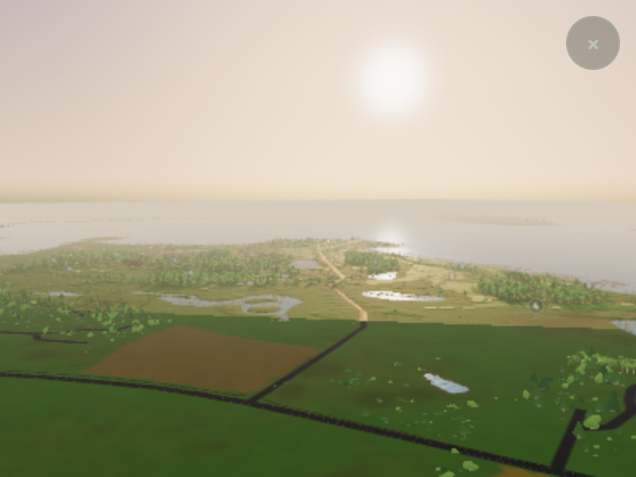
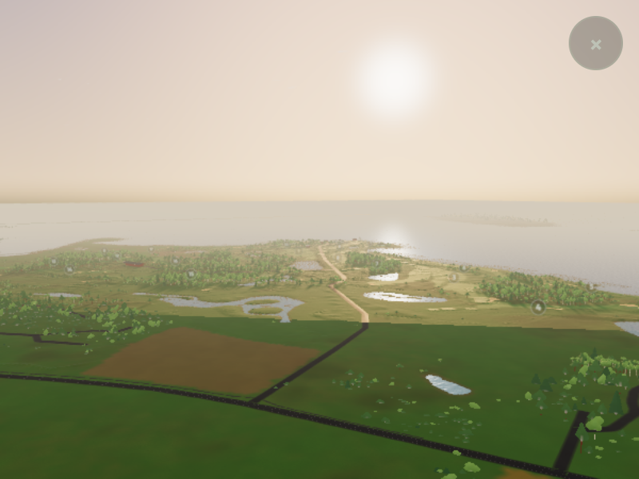

# Mobile screen clarity independent of scene quality

Prepared 2026-09-09, following the merged [Visby water correction](visby-webgl-water-distance.md).

## What changes

Low quality previously fixed the drawing buffer at DPR 1. On a high-DPI phone,
the browser enlarged the entire rendered landscape. Raising the buffer also
raised the viewport used by terrain selection and optional screen-space tree
LOD, potentially adding geometry at the same time as pixel work.

The shared WebGPU/WebGL2 renderer now separates those budgets. Low mode still
starts at DPR 1, with its existing terrain, vegetation and shadows. Once the
first view has appeared, it can earn a sharper buffer from measured frame
intervals. The scene's geometry budget stays at its original quality level.

| Policy | Behavior |
| --- | --- |
| Low-quality automatic clarity | DPR 1 → 1.25 → 1.5, only on displays that support the next step |
| Extra pixel limit | A higher step must fit within 1,000,000 drawing-buffer pixels; existing DPR-1 views above that size are preserved |
| Promotion | Five consecutive one-second windows whose p90 frame interval, scaled by the next pixel-area ratio, is below 28 ms |
| Promotion cooldown | At least 10 seconds between increases |
| Slowdown | Two consecutive windows above 37 ms step down one level; no increase for 60 seconds afterward |
| Long frame gap | Return to DPR 1 after a foreground gap over one second, then gather new evidence |
| Startup, hidden page, capture lock | Discard timing samples; allow 1.5 seconds to settle before sampling again |
| Rotation / resize | Recompute limits and restart automatic low mode at DPR 1; apply size and ratio together |
| High quality | Existing default of native DPR capped at 2; existing performance fallback remains |
| `det=1`, `qualitylock=1`, `graphics=0` | Automatic clarity is disabled; existing default resolution is preserved |

Frame intervals include CPU work, scheduling and display pacing. The pixel-area
estimate is a conservative trigger for a trial, **not a GPU measurement or a
guarantee of 30 FPS**. The controller continues observing the resulting view and
reduces resolution if necessary. A phone without sufficient headroom remains at
DPR 1; this change cannot promise sharper output on every device.

At DPR 1.25 the buffer contains about 56% more pixels than DPR 1; at DPR 1.5 it
contains 125% more. Fragment work and output-target memory increase. There is no
additional render pass, texture asset, shadow-map enlargement or geometry
allocation requested by the clarity controller. These pixel ratios do not imply
the same percentage increase in total frame time or total application memory.

## Filtering findings

The shared detail texture already has mipmaps and requests anisotropy 8. Ground
mowing bands already fade with their pixel footprint, and surface transitions
already use derivative-based antialiasing. Semantic class IDs and the coastal
coverage mask intentionally use nearest filtering: smoothing those data would
mix unrelated classes or alter where terrain is suppressed.

This pass therefore changes output sampling and quality policy. It does not
increase atlas resolution or change material shaders, accepted outlines, water
levels, the coastal mask, terrain topology, or source height sampling. The
separate [ground relief pilot](https://github.com/olovmelander/olovs-hemsida/pull/29)
also fixes the packed detail texture's canvas upload; that work remains separate.

## Comparison controls

`resolution=1`, `1.25`, `1.5` or `2` selects fixed screen sharpness independently
of `q`. Low quality still caps the request at the supported display/pixel-budget
step; high quality caps it at the lower of native DPR and 2. A numeric request also works under
the deterministic and quality locks. Missing, `auto`, or invalid values use the
normal policy. No preference is written to local storage by this controller.

Useful phone comparisons after deployment:

- `?bana=visby&q=lo&resolution=1` — original low-mode resolution.
- `?bana=visby&q=lo&resolution=1.5` — fixed sharper low mode, within its limits.
- `?bana=visby&q=lo` — automatic clarity with the current graphics default.

`V3D.quality().resolution` reports the requested/effective ratio, geometry ratio,
cap, current p90 interval, number of changes and last change reason. This is
diagnostic information, not a new product settings screen.

## Validation and provenance

The full-course capture build uses code commit
[`5654204`](https://github.com/olovmelander/olovs-hemsida/commit/5654204fee2d535f2ea74eb7e3cbf9cf9749f63b),
tree `399ee930c3d3748dbc5482583bd4a0afc16d7d56`. The follow-up changes only
initialization/resize to apply viewport size and DPR in one operation and adds
its regression test. Final backend proofs include that follow-up. Course views
keep their original viewport throughout; no resize is involved in that pair.

- Production build and all 11 published course asset-isolation checks pass.
- Resolution policy tests cover sustained headroom, slowdowns, cooldowns,
  startup/background/capture exclusions, fixed controls, high-quality fallback,
  native DPR, pixel limits and rotation. The real application's frame-order test
  verifies resolution feedback occurs before visibility while terrain keeps its
  independent geometry budget.
- `tools/v2-resolution-review.mjs` exercises the actual controller and Three
  renderer on WebGL2 and WebGPU with simulated timing inputs. Both show a sharper
  synthetic scene at DPR 1.5 with unchanged 1,055 triangles and 63 draws. Returning
  to DPR 1 restores baseline pixels exactly; portrait resizing also passes.
- Against a DPR-2 reference, synthetic mean absolute RGBA-byte error falls from
  1.3490 to 0.7639 on WebGL2, and 1.3533 to 0.7789 on WebGPU. This metric describes
  that sampling fixture, not a percentage improvement in course graphics.

The matched Visby shallow coastal view passes on the automatic WebGL2 fallback
with reversed depth, low quality and the same 400×300 CSS viewport on a DPR-2
display. Only the requested screen resolution changes: 400×300 → 600×450 rendered
pixels, displayed in the same 800×600 screenshot. Both retain 120 draws and
7,362,040 submitted whole-frame triangles, including render passes. Model,
routing, terrain inventory, source/tint data, camera/lens, tree settings and
coastal water metadata match exactly; loading and failed tile counts are zero.

| DPR 1 | DPR 1.5 |
| --- | --- |
|  |  |

The sharper capture has clearer tree silhouettes, paths and distant edges. The
broad open-sea breakup remains absent in this view. Low-tier tree shapes and
coarse surface boundaries remain visible. Three's accounted memory grows from
234,973,682 to 236,773,682 bytes; these counters are not complete browser/GPU
memory. [Evidence summary and image hashes](graphics/mobile-render-clarity-2026-09-09/summary.json)
retain the comparison invariants and separate synthetic/backend proof results.

## Reproduction

Build into a fresh output directory, then run matched captures at the same CSS
viewport and physical display DPR. Change only `--resolution` between runs:

```sh
node tools/v2-graphics-review.mjs --root /path/to/build --course visby \
  --backend webgl2 --auto-fallback --q lo --graphics 1 --resolution 1 \
  --views 1:visby-coast-low:golden --width 400 --height 300 --dpr 2 \
  --timeout 900 --chrome /path/to/chromium --out /tmp/clarity-before
```

Repeat with `--resolution 1.5 --out /tmp/clarity-after`. The ordinary `--compare`
mode intentionally rejects different drawing buffers; use the retained clarity
summary to inspect this deliberate resolution difference alongside all the
unchanged scene/data fingerprints.

```sh
node tools/v2-resolution-review.mjs --backend webgl2 \
  --chrome /path/to/chromium --out /tmp/resolution-webgl2
node tools/v2-resolution-review.mjs --backend webgpu \
  --chrome /path/to/chromium --out /tmp/resolution-webgpu
```

All retained browser evidence uses Chromium 153/SwiftShader. Physical-phone and
older-desktop sustained frame times, camera motion and thermal behavior remain
unmeasured. The Visby sea's conservative shoreline collar and coarse source
surface boundaries remain separate limitations. Blender is not needed.
