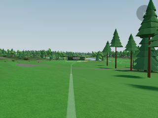

# Terrain render optimization — 9 September 2026

This implements the P0 ring-terrain item in the [graphics improvement guide](v2-graphics-improvement-guide.md). It needs no Blender or new assets. The aim is less GPU terrain work with the finest available course surface preserved. It is a performance foundation for subsequent material and lighting improvements, not a new visual style.

Visby's subsequent phone report is investigated in [the WebGL2 coastal depth follow-up](visby-webgl-water-distance.md). Native-terrain captures also reproduce distant water breakup: the sea sheet competes with the laser water surface independently of grid simplification. The follow-up masks redundant underwater terrain in verified sea interiors. Low-quality framebuffer resolution is a separate source of landscape softness.

**24 September update:** the reduced grid is no longer a phone default. Every device and backend draws native grids; see [below](#24-september-phones-draw-the-desktop-terrain). Later that day the course took priority: [one screen pixel on the holes, three off them](#later-on-24-september-the-course-first). The sections after those describe the 9 September pilot, which `?terrainStride=2` still reproduces.

## 24 September: phones draw the desktop terrain

The owner asked for the 1 m terrain on phones as well. Terrain detail no longer depends on quality, device or backend ([`terrain-detail.mjs`](../apps/golf/src/engine/terrain-detail.mjs)):

- Every tile is drawn at its native grid. A coarser level is drawn only while it stays within **one pixel** of the finer surface on screen, and the frontier may hold **128 tiles**.
- Before, low quality on WebGL2 drew refinable levels at half density within 1.5 px and capped the frontier at 56 tiles; low quality on WebGPU capped it at 56; WebGL2 desktops accepted 1.5 px. High-quality WebGPU is unchanged.
- The active hole's tiles are still always 1 m, and CPU heights still come from the 1 m source and rings.
- Low quality keeps its own streaming: two concurrent requests, a smaller cache of unused tiles and a tile texture that grows with the frontier in groups of eight, the path the reduced grid already used. The desktop reserves all 128 native layers up front, 67.6 MB on the CPU and again on the GPU, which would be most of the [96 MiB pilot phone texture budget](v2-graphics-improvement-guide.md#8-performance-budgets-and-quality-tiers); the phone runs below reserved 25–34 MB.

What the reduced grid did depended on the view. The planner adds each simplified parent's measured error to its budget, so it refined many of those parents into full-density 1 m children near the camera, the half-density tiles it kept were off by up to 1.8 px, and in landscape the 56-tile cap stopped it early. Now every refinable tile stays within about one pixel (the planner's 15% hysteresis allows 1.15). Terrain triangles change by −21% to +60% per view: Visby, whose reduced grid drew 6–10 half-density tiles per view, rises most, from the lightest base. Phone-size views, WebGL2, low quality locked, draw calls skipped under SwiftShader, so these are counts, not frame rate. Tiles are given as all (1 m, half density):

| Phone view | Before: tiles | Terrain | Largest error | Now: tiles | Terrain | Largest error |
| --- | ---: | ---: | ---: | ---: | ---: | ---: |
| Veckefjärden, 1st tee | 28 (20, 0) | 3.73 M | — | 28 (19, 0) | 3.73 M | 0.65 px |
| Veckefjärden, 9th orbit | 40 (30, 3) | 5.03 M | 1.54 px | 32 (20, 0) | 4.26 M | 1.07 px |
| Veckefjärden, 14th tee | 28 (11, 7) | 3.03 M | 1.67 px | 25 (11, 0) | 3.33 M | 0.97 px |
| Visby, 1st tee | 14 (8, 6) | 1.27 M | 0.95 px | 13 (6, 0) | 1.73 M | 0.71 px |
| Visby, 9th orbit | 20 (10, 10) | 1.67 M | 1.49 px | 20 (10, 0) | 2.66 M | 1.06 px |
| Visby, 14th tee | 22 (12, 10) | 1.94 M | 0.87 px | 19 (7, 0) | 2.53 M | 0.97 px |
| Upsala, 1st tee | 42 (33, 7) | 4.90 M | 1.62 px | 39 (29, 0) | 5.19 M | 1.05 px |
| Upsala, 9th orbit | 29 (15, 5) | 3.36 M | 1.68 px | 20 (10, 0) | 2.66 M | 1.13 px |
| Upsala, 14th tee | 29 (18, 7) | 3.17 M | 1.58 px | 21 (14, 0) | 2.80 M | 1.01 px |
| Veckefjärden landscape, 1st tee | 56 (34, 18) | 5.67 M | 1.72 px | 41 (14, 0) | 5.46 M | 1.10 px |
| Veckefjärden landscape, 9th orbit | 56 (37, 16) | 5.87 M | 1.82 px | 49 (22, 0) | 6.52 M | 0.92 px |

Portrait is 412 × 915 and landscape 915 × 412. The largest error is taken over the drawn tiles that have finer children; a leaf is already the finest data at its place, such as the 1 m tile under a tee camera. Overhead views draw as many tiles at the same cost (Upsala now draws one of its ten as a 2 m tile, within 0.52 px), except Veckefjärden landscape, where four half-density tiles become native (1.73 → 2.13 M). Where the old frontier drew more 1 m tiles, they surrounded its half-density parents; the new frontier's 2 m tiles there stay within a pixel of the 1 m surface.

Through Veckefjärden's hole 1 and 9 flyovers, terrain triangles per frame fall from 4.33 / 5.26 M to 4.13 / 3.86 M (median; peaks 5.29 / 5.99 M to 4.79 / 4.79 M), and the largest error per frame from 1.59 / 1.46 px to 1.02 / 1.06 px (p90 2.53 / 1.70 px to 1.14 / 1.14 px). Opening Veckefjärden, three interleaved runs each, took 21.3 s against 22.8 s; the opening terrain settled in 0.7 s instead of 1.5 s. After opening, the phone's tile texture holds 25–34 MB instead of 15–29 MB, sized by the construction-time plan from above the course.

A 1920 × 1080 desktop at one pixel draws 34–59 of its 70–79 tiles at 1 m in the same tee and orbit views; it sees more ground across a wider, taller canvas and applies the same rule per pixel. One pixel was then measured in the pixels the canvas draws (device pixel ratio 1 at low quality), so a phone refined as a desktop of the same CSS height did; later that day it became the screen's own pixel, below. Physical-phone frame rate and memory remain unmeasured, and the WebGPU phone path was not run here. Evidence: [graphics/phone-terrain-1m-2026-09-24](graphics/phone-terrain-1m-2026-09-24/).

## Later on 24 September: the course first

The owner's rule: the holes must be perfect and as detailed as possible; ground off the course need not match. The terrain is stored as nested rings: 1 m and 2 m over the 4 × 4 km around the course, 4 m to 8 km, 8 m to 16 km, then 16, 32 and 64 m copies of the whole. Each frame the planner draws, for each place, the coarsest ring that still meets its target. Two changes move those switch points ([`terrain-detail.mjs`](../apps/golf/src/engine/terrain-detail.mjs), [`terrain-tile-manager.mjs`](../packages/course-v2/runtime/terrain-tile-manager.mjs)):

- **The pixel is the screen's own.** Terrain error is measured at the device's pixel density, up to two per CSS pixel, as a high-quality desktop always did, whatever resolution the low-quality canvas is drawn at (`terrainDetailHeight` in [`render-resolution.mjs`](../apps/golf/src/engine/render-resolution.mjs)). Tree LOD keeps its own budget.
- **The course keeps one pixel; the rest three.** Every hole's tiles (the finest tiles within 80–90 m of each tee-to-green line, so tees, fairways, greens, rough and bunkers) and the tiles containing them keep the one-pixel target. Ground that neither is nor contains a course tile stops at three. A tight budget goes to the tiles furthest over their own target, and the active hole is still forced to 1 m. `?offcourse=1|2|3|4|6|8` compares targets; 1 is the course rule everywhere.

Only 29 of Veckefjärden's 256 1 m tiles are on the course. A phone at device pixel ratio 3 (412 × 915 portrait, 915 × 412 landscape), WebGL2, low quality locked, SwiftShader counts; "course at 1 m" counts the visible course tiles drawn as themselves:

| Veckefjärden, phone | Main: course at 1 m / terrain | Course rule everywhere | Now: 3 px off the course |
| --- | ---: | ---: | ---: |
| Portrait, 1st tee | 4 of 4 / 3.73 M | 4 of 4 / 3.73 M | 4 of 4 / 2.66 M |
| Portrait, 9th orbit | 5 of 5 / 4.26 M | 5 of 5 / 5.59 M | 5 of 5 / 3.33 M |
| Portrait, 14th tee | 3 of 3 / 3.33 M | 3 of 3 / 3.86 M | 3 of 3 / 3.33 M |
| Landscape, 1st tee | 8 of 11 / 5.46 M | 11 of 11 / 8.92 M | 11 of 11 / 4.93 M |
| Landscape, 9th orbit | 10 of 12 / 6.52 M | 11 of 12 / 10.52 M | 11 of 12 / 5.86 M |
| Landscape, 14th tee | 5 of 13 / 4.93 M | 11 of 13 / 10.38 M | 11 of 13 / 4.39 M |

A course tile not drawn at 1 m is covered by a coarser tile within one screen pixel of it; off the course the ground stays within 3.45 px (three pixels and the planner's 15% hysteresis). Overhead views are unchanged. Two and four pixels off the course were measured too: two costs more than main in landscape; four saves another 20–28% at the portrait tees but leaves the ground off the course up to 4.4 px out, so three is the middle.

Through the portrait flyovers of holes 1 and 9, terrain triangles per frame fall from 4.13 / 3.86 M to 3.33 / 3.59 M (median), and the share of visible course tiles at 1 m never drops below 75% / 100% (main 41% / 80%). The landscape hole 1 flyover falls from 5.32 to 4.93 M with the whole visible course at 1 m in the median frame (main 78%).

Visby and Upsala draw as much or more of their course at 1 m, at −13% to +16% terrain triangles per view: Visby's 14th tee has 11 of 12 course tiles at 1 m (main 6), Upsala's 11 of 11 (main 9). A 1920 × 1080 desktop at high quality keeps every course tile it drew at 1 m and draws about half the terrain: 9.32 → 4.66 M at the 1st tee, 10.52 → 6.26 M at the 9th orbit, 9.45 → 4.53 M at the 14th tee.

Opening Veckefjärden at device pixel ratio 3 took 39.7 s against 40.0 s (three interleaved runs each). After opening, the tile texture holds 25–42 MB against main's 25–38 MB; boot timing sets it within that range. The course is resolved in 256 m tiles, so ground far from every hole's line, such as a practice area, counts as off the course. Physical-phone frame rate and memory remain unmeasured, and the WebGPU phone path was not run here. Evidence: [graphics/phone-terrain-reach-2026-09-24](graphics/phone-terrain-reach-2026-09-24/).

## Policy

The parent-linked graph adapter now consumes `renderStride`. Low-quality WebGL2 already requested stride 2; that request now reaches the runtime. High-quality WebGL2 and WebGPU keep stride 1 by default. `terrainStride=1` or `terrainStride=2` provides a reversible comparison on either backend.

Only tiles with four finer children are eligible for a 257 × 257 to 129 × 129 render grid. Every leaf stays full resolution, including leaves in distant rings. Shell and unsupported small grids keep their original geometry. Existing active-hole requirements, quality budgets and geographic selection remain in force.

The simplifier measures the maximum difference from the original triangulated mesh at every source vertex and adds it to the tile's source error for screen-space selection. Both triangulations share aligned diagonals, so these vertices bound the surface difference. The planner can recover finer children when the added error matters. This remains subject to the existing tile budget; it is not a promise that every distant tile meets a hard screen-error ceiling.

## Height and transition correctness

- Full source payloads and CPU height queries remain at their original resolution. The source manifests, terrain chunks, routing, surface masks and object coordinates are not rewritten.
- Kept render vertices retain their source normals and fine world heights. Existing edge skirts remain present.
- Children wait for their already-requested parent resource and reconstruct morph targets from that parent's actual rendered triangles. They do not start another transport. A real-data regression found a 0.76 m mismatch when an Upsala coarse child reconstructed its parent only from its own samples; the implementation now uses the actual parent.
- If a parent lies below the child's encoded height offset, both packed height channels shift by whole quantization steps. This preserves the fine world heights and prevents negative targets from wrapping or clipping. An unrepresentable range fails explicitly.
- Native and reduced grids use separate shared batches. Compact batches grow in groups of eight, preserve existing morph clocks during growth, and dispose an unused grid batch. The combined rendered tile count remains bounded. A mixed frontier can require two regular terrain draws instead of one.

Source resources remain available alongside the derived render views. Reduced texture storage per tile is not a claim of lower total CPU memory or download size. Capacity depends on camera history, and allocations/upload spikes need device measurement.

## Work reduction

| One terrain tile, including skirts | Native | Reduced | Reduction |
| --- | ---: | ---: | ---: |
| Grid samples | 257 × 257 | 129 × 129 | 74.8% |
| Triangles | 133,120 | 33,792 | 74.6% |
| Packed height/normal bytes | 528,392 | 133,128 | 74.8% |

The final Upsala H1 tee capture at 320 × 240 rendered 23 native and 11 reduced tiles: 3,433,472 streamed-terrain triangles. Rendering those same 34 tiles natively would require 4,526,080 triangles (24.1% fewer with the optimized grids). This is arithmetic for the same selected tiles, not a separately captured native-policy baseline.



These are exact per-tile counts, not whole-scene or frame-rate gains. Preserving leaves intentionally limits savings in close course views. An overhead view containing only native leaves saves no terrain triangles.

## Validation

The regression coverage includes unchanged CPU heights, fine vertex heights and normals, triangle interpolation, error budgets, shared edges, below-offset parent targets, parent/child transitions against published Upsala/Lidingö/Visby tiles, out-of-order loading, mixed grid budgets, batch disposal and morph-preserving growth. Runtime tests exercise both backend profiles; browser captures are separate shader/rendering evidence.

The final source passes **533 Vitest tests and 404 Node tests**, with three Node skips. The production build, all 11 published-graph build isolation checks and the renderer proof build pass. Full-app Upsala H1 tee captures pass on both WebGL2 and WebGPU at 320 × 240. The isolated native/mixed-grid proof also passes on both backends.

Validation results and capture provenance are recorded in [the evidence summary](graphics/terrain-render-optimization-2026-09-09.json). Software rendering establishes correctness and submitted workload only. It does not establish phone or older-desktop FPS.

## Reproduce and release checks

Install the root dependencies and the separately documented COPC reader dependencies for the full Node suite:

```sh
pnpm install --frozen-lockfile
npm install --prefix packages/course-geo/copc-reader
pnpm exec vitest run --maxWorkers=2 --testTimeout=30000
pnpm test
pnpm --filter @banvy/golf exec vite build --emptyOutDir
node packages/course-v2/check-app-build.mjs
node packages/course-v2/check-renderer-build.mjs
```

The explicit Vitest timeout is useful on a CPU shared with SwiftShader. The normal repository test command keeps its original timeout.

Capture matched cameras with the same viewport, backend, quality, graphics setting and device pixel ratio:

```sh
node tools/v2-graphics-review.mjs --root apps/golf/dist --course upsala --backend webgl2 --q lo --graphics 1 --terrain-stride 1 --views 1:tee:noon,1:top:noon --width 640 --height 480 --out /tmp/terrain-native
node tools/v2-graphics-review.mjs --root apps/golf/dist --course upsala --backend webgl2 --q lo --graphics 1 --terrain-stride 2 --views 1:tee:noon,1:top:noon --width 640 --height 480 --out /tmp/terrain-reduced
```

Use `--backend webgpu` for WebGPU and `--auto-fallback` for its automatic WebGL2 fallback. A current Chromium executable may be supplied with `--chrome`. The standalone `v2-terrain-proof.html?terrainStride=2` also exercises native and reduced grids together; append `&gl=1` to force WebGL2.

The general graphics harness's `--compare` requires identical terrain inventories, so it intentionally rejects a stride comparison. Compare its mapping fingerprints, cameras, buffer dimensions and terrain stream statistics directly. Mesh dimensions and morph payload identities are expected to change. Use `terrain.stream.triangles` and batch capacities; whole-renderer frame counters can include an intermittent shadow refresh.

Before promoting the pilot, inspect tee, green, overhead and moving-camera transitions in Upsala, Lidingö and coastal Visby on an actual phone and an older desktop. Check water, tree and grass contacts and mixed-grid boundaries. Measure median/p95/p99 frame time and memory during view changes. Keep WebGPU's default native policy until its device evidence supports a change. No hardware speedup or deployment is claimed by this branch.
