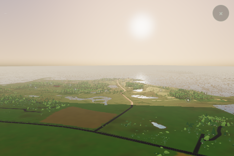
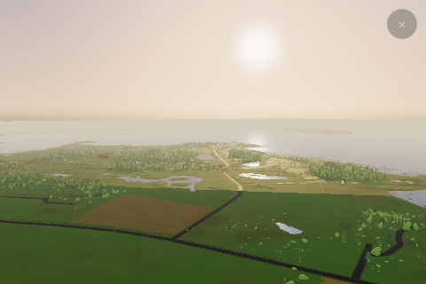

# Visby: distant water on WebGL2

The owner reported water glitching and soft landscape detail when zooming out
on a phone, and identified Visby and WebGL2. The water failure reproduces with
native terrain, independently of the terrain simplification in PR #28.

## What the evidence establishes

Visby preserves measured terrain. Its laser data records the sea surface, not
an underwater bed. The app draws a separate water sheet only centimetres above
that surface. At distance these differently triangulated surfaces compete in
the depth buffer, producing patches of exposed terrain through the water.

Two native-terrain coastal captures reproduce the breakup. An adaptive near
plane passes numerical 24-bit depth tests, but **does not remove the rendered
failure by itself**. Isolated renders of two flat surfaces reproduce it without
course assets, terrain simplification, wave textures or sun glare. Disabling the
water depth test removes the interference, but would also remove normal land
occlusion, so that is not the production fix.

The earlier [water occlusion fix](../visbybuild/mapping/water-occlusion-2026-09-09.md)
correctly protected dry land by removing polygon offset and making terrain win
unresolved depth ties. Restoring a global bias or raising the sea would trade
this problem for water over foreground land. The
[Khronos depth-precision discussion](https://wikis.khronos.org/opengl/Depth_Buffer_Precision)
explains the fixed-depth limitation; the GPU reproduction also demonstrates why
a scalar depth calculation alone is insufficient evidence for a visual fix.

Landscape softness has a separate cause: the low quality tier uses pixel ratio
1 even on high-DPI phones. Texture minification and terrain selection also
reduce distant detail. Grid simplification changes eligible coarse meshes, not
the framebuffer resolution. Leaf meshes and CPU heights retain source detail.

## Correction

Render one sea surface in verified water interiors. A conservative material
mask removes the redundant low laser-surface fragments beneath that water:

- Offshore coverage is exactly the set of cells already emitted as coastal
  water geometry. The water extension itself is unchanged.
- Inside the mapped window, a covered cell must lie in mapped sea and its
  centre must be more than a full cell diagonal from an observed shoreline or
  island boundary. At 32 m spacing this reserves about 45 m around shores.
- Terrain above the existing sea-level tolerance always remains visible,
  including elevated land within a marked cell.
- Nearest filtering and no mipmaps prevent coverage from spreading to adjacent
  dry cells. Explicit bounds prevent texture clamping outside the world.
- The mask preserves the decorator's `v2SurfaceAuthority` identity, so the
  reviewed surface-source gate remains effective in preflight.

The mask is 512 × 512 bytes for Visby's 16 km world: **256 KiB**, one shared
texture and no additional draw call. Geometry, CPU height queries, source water
levels, polygons, routing and tree placement remain unchanged. Water still uses
normal depth testing against land. This is visibility of a redundant water
surface, not invented bathymetry or a lower-resolution terrain dataset.

The complementary camera change improves fixed-depth precision around unmasked
edges in elevated WebGL2 coastal views. It derives the near plane from clearance
above the entire terrain graph, allows 64 m for scenery, and caps near by that
clearance / 8, focus distance / 32 and 128 m. Ground-level views return immediately
to 1 m. WebGPU retains its original near plane. Future assets above the scenery
allowance require revisiting this bound. The original graphics=0 comparison
path retains its established frame-order behavior.

## Validation

The source passes 539 Vitest tests, 15 focused coastal/terrain Node tests, the
production build and the full published-graph asset-isolation gate.

The published Visby check protects 1,404 played points, all 65,536 sampled source
positions, 64 low dry samples and 11,631 interior samples in ten islands. These
checks now validate terrain masking as well as sea geometry. The source-model
check and live packaged-course capture retain their own provenance; they are
not interchangeable fingerprints.

`tools/v2-coastal-depth-review.mjs` exercises the production mask and water depth
policy over flat terrain, with both raised land and an asymmetric low dry island.
It checks that sea pixels remain visible, dry land survives, and texture-row
orientation is correct. Its unmasked WebGL2 control must reproduce the breakup.
The full-course comparisons additionally record source/data fingerprints,
terrain inventories, camera pose, lens and quality settings.

Both full Visby WebGL2 coastal views pass, with zero failed tile loads or browser
errors. The depth-only and masked captures have identical terrain inventories,
camera/lens settings, water geometry and scene fingerprints. Their difference is
the visibility mask. The two-backend synthetic proof also passes: WebGL2 open-sea
leak counts fall from 40,462 to 0 in the overview and 24,269 to 6 at the low angle,
while both islands remain visible. These counts exclude a two-pixel rasterized
shoreline boundary and are not measurements of the full-course images.

| Depth-only control, same optimized terrain | With the verified-sea mask |
| --- | --- |
|  |  |

The conservative shoreline collar retains its original terrain and can retain
small edge artifacts. This change removes the broad open-sea interference; it
does not promise an artifact-free shoreline at every distance.

Evidence is recorded under
[`graphics/visby-water-distance-2026-09-09`](graphics/visby-water-distance-2026-09-09/).
The native baseline uses the material-pilot build with `surfaceRelief` disabled;
that rendering path matches main at `32a0ae0`. The depth-only control and masked
candidate use stride 2. Compare those two controls to isolate the visibility
change; comparing native stride 1 directly to the masked candidate changes two
variables.

Software rendering establishes correctness, not phone FPS. The final hardware
acceptance check is a Visby coastal orbit on the owner's WebGL2 phone followed
by a return to tee height: sea continuous, dry land visible, no nearby clipping.
High-DPI landscape quality tuning remains separate work.

## Reproduce

```sh
node tools/v2-coastal-depth-review.mjs --backend webgl2 --chrome /path/to/chromium --out /path/to/proof-gl
node tools/v2-coastal-depth-review.mjs --backend webgpu --chrome /path/to/chromium --out /path/to/proof-gpu
node tools/v2-graphics-review.mjs --root /path/to/build --course visby \
  --backend webgl2 --auto-fallback --q lo --graphics 1 --terrain-stride 2 \
  --views 1:visby-coast:golden,1:visby-coast-low:golden \
  --width 480 --height 320 --timeout 600 --chrome /path/to/chromium \
  --out /path/to/separate-output
```

Use stride 1 for the native-grid control. Omit `--auto-fallback` to force the
conventional WebGL2 initialization path. The generic `--compare` gate requires
matching requests and terrain inventories; use the recorded comparison summary
when a deliberate stride, near-plane or diagnostic-field change differs.
