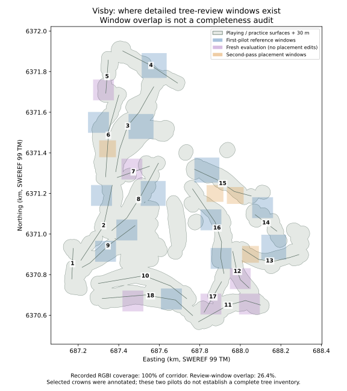

# Visby: remaining coverage and precision work

Audit date: 2026-09-16. This is a read-only assessment of the [first pilot](../README.md) and [second pass](../round2/README.md). It creates coverage and diagnostic artifacts; it does not change tree positions, source annotations, selected detector settings, either preview generation or production.

The next useful improvement is **systematic source review of the remaining play-relevant area**, followed by resolution of important ambiguous placements and inherited exclusions. The existing imagery is sufficient to start this work. The current detector has useful geometry improvements on commonly matched crowns, but still misses the detection target.

## Coverage findings

| Measure | Result | Meaning |
|---|---:|---|
| Playing/practice surfaces plus 30 m | 658,652 m² | Reproducible union using the pilot's surface/exclusion inputs; not the whole property or all shot-critical surroundings. |
| Recorded fully valid RGBI footprints | 100% of this corridor | All 68 acquisition windows are recorded as fully valid. This audit uses their metadata; it does not redownload or rehash every image byte. |
| Intersection with all 23 detailed review windows | 26.4% of corridor | **Upper bound on potential detailed review extent**, not a percentage of trees or area completely inspected. Selected crowns were annotated inside these windows. |
| Intersection excluding six fresh evaluation windows | 19.5% of corridor | Extent of first-pilot and later placement-review windows; again, not certified completion. |
| Holes with a dedicated sample window | 17 of 18 | Hole 1 has none. Screenshots exist for all holes, but do not establish source-review completeness. |
| Reference crown entries | 208 annotated; 197 scorable | Original 143 entries (133 scorable), plus 65 fresh entries (64 scorable). Reference eligibility and ambiguity are preserved. |
| Unresolved correction-catalogue cases | 34 | 23 from the first pilot and 11 from the second. These are catalogue cases, not a deduplicated count of unique missing trees. |
| Retained individual records absent from instance export | 8 | Separate runtime/exclusion investigations; absence from rendering does not prove a missing real tree. |

The fresh reference also contains one unresolved low-height crown. It remains a reference ambiguity, separate from the correction-catalogue count. The first reference has 140 interpreted entries and three low-height unresolved entries; ten of its entries are unscorable under the frozen protocol. Do not equate all annotated entries with clearly interpretable scoring references.



Download [coverage measurements and source hashes](coverage.json), the [QGIS coverage layer](coverage.geojson), or the [standalone map](coverage.svg). Geometry uses SWEREF 99 TM, EPSG:3006. The map deliberately shows window extent rather than marking unsystematically reviewed land as complete.

### Per-hole diagnostic

Each row's area is that hole's line buffered 90 m, intersected with the global playing/practice + 30 m corridor. These diagnostic areas can overlap: **do not sum their areas or interpret them as surveyed hole boundaries**. Reference/decision counts follow their recorded scene's hole assignment. A zero crown count in a sampled window does not imply the entire hole is treeless.

| Hole | Window overlap in diagnostic area | Reference entries / scorable | Accepted edits, both passes | Unresolved catalogue cases |
|---|---:|---:|---:|---:|
| 1 | 0.0% | 0 / 0 | 0 | 0 |
| 2 | 18.0% | 11 / 9 | 9 | 2 |
| 3 | 29.6% | 12 / 10 | 6 | 6 |
| 4 | 21.4% | 0 / 0 | 0 | 0 |
| 5 | 25.8% | 13 / 13 | 0 | 0 |
| 6 | 29.8% | 5 / 5 | 7 | 3 |
| 7 | 21.3% | 22 / 22 | 0 | 0 |
| 8 | 29.1% | 0 / 0 | 0 | 0 |
| 9 | 25.1% | 6 / 6 | 5 | 1 |
| 10 | 14.5% | 0 / 0 | 0 | 0 |
| 11 | 38.6% | 3 / 2 | 0 | 0 |
| 12 | 52.9% | 18 / 18 | 0 | 0 |
| 13 | 30.9% | 35 / 34 | 34 | 4 |
| 14 | 37.6% | 6 / 4 | 4 | 2 |
| 15 | 44.1% | 18 / 18 | 32 | 7 |
| 16 | 33.3% | 50 / 47 | 41 | 9 |
| 17 | 31.7% | 2 / 2 | 0 | 0 |
| 18 | 24.0% | 7 / 7 | 0 | 0 |

These two pilots do not establish comprehensive source review for any whole hole. Detailed work was deliberately local; the table identifies where a systematic review should begin.

## Precision on the same crowns

The second pass's headline geometry metrics described different sets of matched trees. This audit compares the **31 reference IDs matched by both current Node and the frozen Dalponte candidate**, using the original stored matches and measurements.

| Common-reference metric | Current Node | Frozen Dalponte + recovery |
|---|---:|---:|
| Matched references in this comparison | 31 | 31 |
| Mean crown IoU | 51.8% | 59.3% |
| Median centre disagreement | 1.71 m | 1.32 m |
| p95 centre disagreement | 3.30 m | 3.32 m |

This supports a boundary and median-centre improvement on those same crowns; it does not show improved p95 or solve the missing trees. On the full 64-reference evaluation, Node remains **39 matched / 14 extra / 25 missed**, and the candidate **40 / 16 / 24**. Both score 66.7% F1; the candidate's 71.4% precision and 62.5% recall miss the 90% targets. The original full matched-subset metrics remain unchanged in the second-pass report.

The [paired diagnostic](paired-evaluation.json) retains common IDs, per-crown measurements, method-only match counts and descriptive Wilson intervals. Those intervals assume independent binomial observations; spatially clustered, purposive samples do not justify course-wide confidence bounds. This is a post-evaluation diagnostic, not a new independent test or a reason to retune on the fresh sample. Positions are interpreted crown centres, not surveyed stems.

## Recommended next pass, in priority order

1. **Complete a systematic coverage ledger and source inspection.** Start with hole 1 and unreviewed portions of holes 10, 2 and 4, then cover remaining play-relevant cells across all holes. Use the existing RGBI, LiDAR and older seasonal imagery. Include shot-critical areas beyond the 30 m refinement corridor. Record reviewed negative areas, gaps and measured woodland interiors as well as individual crowns. Mark every cell reviewed, ambiguous, no-data or unreviewed; blocked cells remain explicit. Preserve the six frozen evaluation windows from calibration and new placement edits, or formally retire them and obtain a new unseen sample before claiming another independent evaluation.

2. **Resolve high-impact exceptions with source/exclusion overlays.** Reconcile the 34 catalogue cases across passes, including the first pilot's 13 held base/overhang proposals, without forcing uncertain locations. Inspect the eight retained records absent from the renderer export (IDs and coordinates in `coverage.json`). Their nearest-hole assignments are 3, 10, 12, 16 and 18; those are proximity labels, not ownership. Determine whether each case is a correct exclusion, bad surface boundary, crown-overhang ambiguity or supported individual placement. Do not shift bases sideways to make them render.

3. **Audit canopy lost by inherited masks and small-tree rules.** The 1 m stands preserve the older 4 m eligibility gate, so refinement cannot recover all narrow woodland fingers or canopy excluded upstream. Inspect residual LiDAR canopy outside individual footprints and stands together with RGBI and the exclusion reason. Expand only evidence-supported local coverage. Evaluate young/low trees separately from the current minimum-height filter; image-only plants without defensible height remain unresolved.

4. **Strengthen edge/gap measurement and error-directed detector experiments.** The first pilot measured two local forest-edge segments using one-way reference-to-occupancy distances. Add representative segments across holes, both distance directions, omission/commission area, clearing occupancy and opening continuity. For merged/missed crowns, test canopy construction/smoothing and multi-scale or point-cloud treetop detection on calibration data before a new frozen evaluation. lidR documents these options and their dependence on inputs; no named method is guaranteed to win. [Official lidR documentation](https://r-lidar.github.io/lidRbook/itd.html)

5. **Escalate evidence only where it limits a meaningful decision.** Local 2024 LiDAR first-return density is about 1.44/m², with returns in about 80% of 1 m near-play cells. A finer grid adds no observations. Reconcile seasonal/date differences first; standard orthophotos can displace treetops relative to ground positions. Use targeted dated club photographs/inventory or denser/newer height evidence for unresolved important trees if available. A new purchase, survey or invented image-based height is not assumed. [Lantmäteriet orthophoto explanation](https://www.lantmateriet.se/sv/geotorget-produktstod/fragor-och-svar/)

For another ground, use the updated [workflow](../../../../../../docs/tree-placement-workflow.md) and [review template](../../../../../../docs/templates/tree-placement-review.md). They now require explicit coverage denominators/cell status, paired geometry metrics, bidirectional edge/gap checks, cross-pass issue tracking and evidence-based exclusion review. The next adapter must be exercised on a second ground before it is described as generic automation.

## Reproduction and checks

Run from the repository root with the existing verified pilot caches:

```powershell
& upsalabuild/cache/review-venv/Scripts/python.exe -W ignore::DeprecationWarning tools/visby-tree-pilot/coverage_audit.py
```

The [audit script](../../../../../../tools/visby-tree-pilot/coverage_audit.py) writes this directory's JSON/GeoJSON/SVG outputs. It verifies the frozen fresh-reference and detector code hashes, reconciles stored match counts/IDs, checks coverage fractions and every-hole accounting, and asserts that hashed input files and production/preview root manifests remain unchanged. It records its own code hash and inputs for reproducibility. Source rasters/caches and baseline graphs must be retained; this is a Visby-specific diagnostic, not a generic complete-review implementation.

The audit and documentation changes need no new app build or browser-performance claim. Existing runtime validation belongs to the retained pilots. A new placement pass must repeat the appropriate source, runtime and performance checks before its result is accepted.
