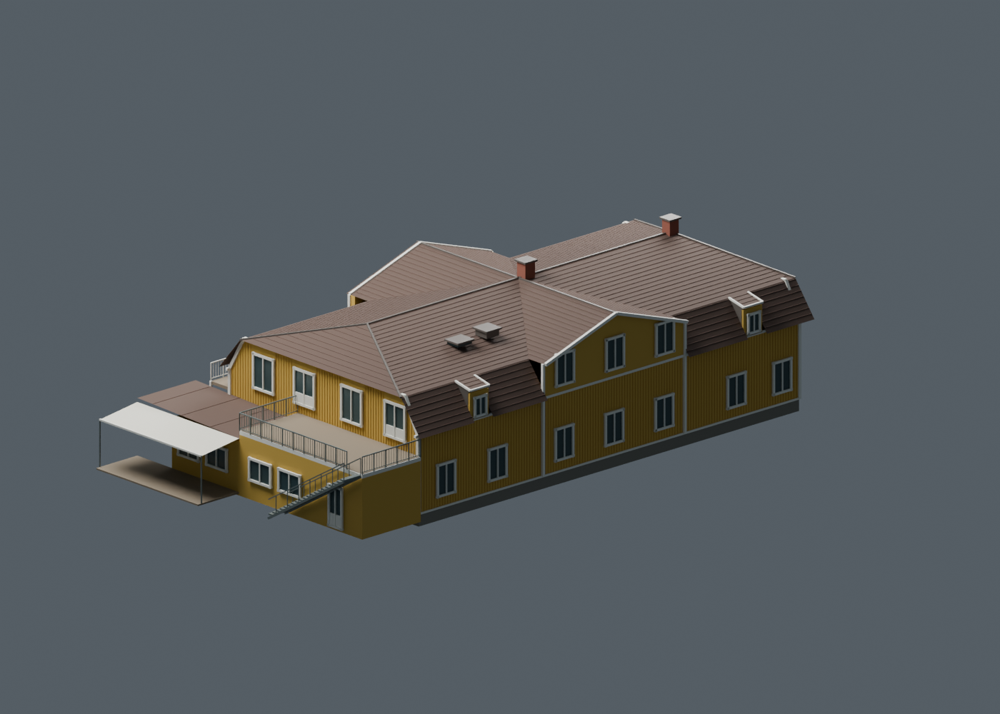

# Tortuna clubhouse in Blender

The clubhouse `way/1163533127` now uses an authored exterior model in the
application. It was constructed in Blender 4.5.9 through the existing Blender
MCP add-on on localhost port 9876, using national laser/orthophoto data and nine
retained web photographs. Open [the editable Blender scene](tortuna-clubhouse.blend)
or [the rendered preview](clubhouse-blender.png).



The model includes the shallow upper roof, steep lower roof sections, both
central cross-gables, two northeast dormers, yellow timber façades, white trim,
window and door frames, roof hardware, restaurant extension and awning, balcony,
external staircase and courtyard access gallery. The detached western building
also receives its photographed yellow wall colour; its separate source geometry
is retained. Other buildings still use the existing course building pipeline.

## Evidence and accuracy

- [Photo review](reference-review.md) and [download receipt](reference-receipt.json)
  identify the official drone originals, entrance view and other useful angles.
  The originals stay in `../cache/clubhouse-model/references/`.
- [Geometry evidence](geometry-evidence.json) retains eight measured roof planes,
  source supports, residuals and an explicit distinction between roof/eave
  observations and estimated wall dimensions. The source data are April 2021
  laser returns, the retained native 1 m terrain and May 2026 0.16 m orthophoto.
- [Model parameters](model-parameters.json) describe the authored simplification.
  The main wall body is approximately 27.4 × 14.75 m; the roof eave envelope is
  approximately 28.4 × 15.75 m. The principal ridge is near RH 2000 35.44 m.
  Roof faces are clean approximations of the measured planes, not copies of
  every laser return. Wall boundaries have roughly 0.5–0.7 m interpretation
  uncertainty; window dimensions, roof fittings and terrace details are estimates.
- The central roof ridge differs by about 2.57 m between the native image trace
  and laser coordinates. The reconstruction uses the laser position. The review
  records that discrepancy without shifting the source imagery, OSM footprint
  or measured TIN. The upper southwest gable stays within the measured roof
  limit; the projecting courtyard gallery is a separate lower structure.

This follows the v2 design's separation of source evidence, fixed coordinates
and derived appearance. No new metric or complete-building survey is claimed.
The southwest openings and some terrace details remain incompletely visible.
No original photograph or orthophoto texture is packed into the public asset.

## Application contract

[The publication receipt](published-model.json) binds the self-contained GLB to
the exact clubhouse source-ring checksum. It contains 12 material meshes and
13,812 triangles in 758,472 bytes. The descriptor is loaded through Tortuna's
existing scenery module and fetched only for that course. The GLB has a full
SHA-256 filename, byte/hash validation and an immutable service-worker cache.

Blender vertices use metres in east/north/up about the explicit anchor
E597463.6991434265/N6615075.173127487/H27.1. Standard glTF export gives
east/up/south. Runtime translation is `[63.1991434265, 27.1, -175.673127487]`;
the vertical placement uses absolute RH 2000. The terrain frame's 16.31 m
reference height is not subtracted from building placement.

Only a successfully decoded model replaces the old display geometry. Loading
failure retains the source renderer. `?bana=tortuna&buildingGeometry=source`
skips the GLB and displays the original measured roof. The source clubhouse
ring, its 1,157 roof triangles, the six-building source roof inventory, the
course pack, terrain graph and source manifest remain unchanged.

This is an appearance asset carried by the scenery module, not a replacement
v2 survey/object chunk or a change to source collision/exclusion geometry.
`V3D.authoredBuildings()` exposes loaded/fallback status, verified identity,
absolute bounds, counts and placement for inspection.

## Rebuild and check

From the Tortuna worktree, with Blender's existing add-on listening on 9876:

```powershell
python tortunabuild/blender/mcp_client.py --exec tortunabuild/blender/build_clubhouse.py
& 'C:\Program Files\Blender Foundation\Blender 4.5\blender.exe' --background tortunabuild/clubhouse/tortuna-clubhouse.blend --python tortunabuild/blender/render_clubhouse.py
node tortunabuild/clubhouse/publish-model.mjs
node tortunabuild/check-clubhouse.mjs --base http://localhost:5174/
```

The builder owns only the `Tortuna | Clubhouse architecture` scene. Existing
unrelated scenes remain intact. The separate render process writes a normal
editable `.blend` and the preview without changing the connected Blender's
current file. Source photographs are needed for a new visual review, but the
geometry script can reproduce the asset from committed parameters.

The browser check compares the exact asset and source pack, verifies placement
and single rendering, captures northeast/pond views, then checks source mode
and failed-download fallback. [Browser evidence](browser/report.json) and
[validation receipt](validation.json) record the final verification.
